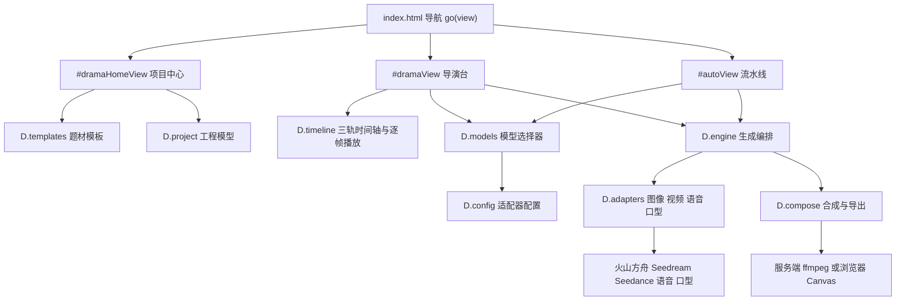

# AI 短剧工作台专业范式重构 · 技术设计

Feature Name: 2026-09-17-drama-workbench-pro
Updated: 2026-09-17

## 描述

把现有两个「表单向导」式短剧工作台重构为专业创作范式：新增项目中心作为工作台入口，手搓台重构为导演台（分镜列表 + 大预览 + 属性面板 + 三轨时间轴），半自动台重构为流水线（阶段条 + 缩略图分镜网格）。两个创作台共用同一套工程模型、生成引擎、模型选择器与合成链路，并以火山方舟全家桶为主接入真实模型。

重构在视图层进行，数据层与生成层保持现有契约，降低回归风险。

## 架构



分层职责：

- 入口层：`index.html` 的 `VIEWS`、`navItems()`、`go(view)` 负责视图切换与渲染派发（现有 `index.html:4276`、`index.html:4279`、`index.html:4332`）。
- 视图层：项目中心 `home.js`、导演台 `manual.js`、流水线 `auto.js`。
- 组件层：时间轴与逐帧播放 `timeline.js`、模型选择器 `models.js`、题材模板 `templates.js`、共用部件 `ui.js`。
- 领域层：工程模型 `project.js`、生成编排 `engine.js`、合规 `compliance.js`、角色 `character.js`。
- 适配层：`adapters/*.js` 负责厂商协议，`adapters.js` 提供 HTTP 与任务轮询通用能力。

## 组件与接口

### 项目中心 `D.home`（新增 `src/drama/home.js`）

- `render()`：把项目中心渲染进 `#dwHome`。渲染搜索框、题材模板区、工程缩略图网格、空状态引导。
- `list(filter)`：返回按 `updatedAt` 倒序的工程数组，`filter` 命中标题或题材。
- `newFromTemplate(tid, mode)`：基于题材模板创建工程，进入 `mode` 对应创作台。
- `newBlank(genre, mode)`：创建空白工程，进入对应创作台。
- `open(pid)`：按工程的 `mode` 字段进入导演台或流水线。
- `remove(pid)`：二次确认后调用 `D.project.remove(pid)` 并重绘。

进入创作台的衔接：项目中心调用 `XLX.go("drama")` 或 `XLX.go("auto")`，创作台从 `D.home.pendingPid` 读取待打开工程 id。`XLX.go` 由现有 `go(view)` 暴露。

### 导演台 `D.manual`（重写 `src/drama/manual.js`）

保留命名空间 `D.manual` 与导出 `{ render, load, state }`，渲染内容改为导演台。

- `render()`：渲染三区布局与时间轴。
- `load(pid)`：加载并归一化工程，见「数据模型」。
- `select(sid)`：切换当前分镜，刷新中区预览与右区属性。
- `generate(sid)`：调用 `D.engine.generateShot`，只影响该分镜（复用 `engine.js:42`）。
- `reshoot(sid)`：保留属性、清空素材引用后调用 `generate(sid)`。
- `synth(sid)`：调用 `D.engine.synthShot`（`engine.js:19`）。
- `compose(kind)`：`kind` 取 `client` 或 `server`，复用现有 `D.compose`。
- `exportPack()`：复用 `D.compose.exportPack`。

布局 DOM 契约（供样式与测试选择器使用）：

```text
#dwManual .dw-console
  .dw-rail            左区：分镜缩略图列表 .dw-rail-item
  .dw-stage           中区：画布预览 .dw-stage-canvas + 播放控件
  .dw-inspector       右区：当前分镜属性
  .dw-timeline        底部：画面轨 配音轨 字幕轨
```

响应式：宽度小于 900 像素时，`.dw-rail` 与 `.dw-inspector` 折叠为抽屉，通过 `.dw-console` 的 `data-panel` 切换；`.dw-stage` 常驻。

### 流水线 `D.auto`（重写 `src/drama/auto.js`）

保留命名空间 `D.auto` 与导出 `{ render, state }`。

- `render()`：渲染阶段条与当前阶段主体。
- `runPlan()`：复用 `D.engine.planScript`（`engine.js:181`）生成分镜草案。
- 阶段主体统一使用缩略图网格：草案、生成中、逐镜检查三个阶段都渲染同一网格组件，仅操作区不同。
- 批量生成复用 `D.engine.generateMany`（`engine.js:92`），逐镜检查阶段的单镜重拍复用导演台的 `reshoot` 逻辑。

### 时间轴与逐帧播放 `D.timeline`（新增 `src/drama/timeline.js`）

- `total(project)`：返回成片总时长，等于各分镜 `duration` 之和。
- `layout(project)`：返回用于渲染的区间数组 `[{ sid, seq, start, end, hasAudio, hasSubtitle }]`。
- `shotAt(project, t)`：返回时间 `t` 所属分镜，`t` 落在 `[0, total)`。
- `render(container, project, opts)`：渲染三轨，`opts` 含 `currentShotId`、`onSeek(sid, t)`、`onSelect(sid)`。
- `frameStep(current, dir, fps)`：返回 `current + dir / fps` 的纯函数，用于逐帧前进后退。
- `createPlayer(video, src)`：包装 `HTMLVideoElement`，暴露 `play`、`pause`、`step(dir)`、`seek(t)`、`time()`、`duration()`。

实现约束：视频素材以 `currentTime` 逐帧步进，`fps` 取 `project.output.fps`；素材为图片时，逐帧操作在同一分镜内无位移，播放控件退化为时长指示。

### 模型选择器 `D.models`（新增 `src/drama/models.js`）

- `kinds`：`["image", "video", "tts", "lipsync"]`。
- `render(kind, opts)`：返回模型选择条的 HTML，展示 provider 名称、当前 model id、配置状态。
- `bind(root, kind, onChange)`：绑定 provider 与 model 的切换。
- `current(kind)`：读取 `D.getAdapterConfig(kind)`（`config.js:231`）。
- `ready(kind)`：读取 `D.isConfigured(kind)`（`config.js:257`），`pollinations` 视为就绪。
- 行为：切换即调用 `D.setAdapterConfig(kind, cfg)`（`config.js:250`）持久化；未就绪时展示「未配置」标记与跳转设置页按钮，跳转调用 `XLX.go("settings")`。

### 题材模板 `D.templates`（新增 `src/drama/templates.js`）

- `list()`：返回内置模板数组。
- `get(tid)`：返回单个模板。
- `apply(project, template)`：把模板的剧种、画风、分镜结构写入工程，分镜提示词追加画风前缀，返回工程。

### 共用部件 `D.ui`（扩展 `src/drama/ui.js`）

在现有 `CSS` 之后追加导演台与流水线样式，沿用 `--panel`、`--border`、`--accent` 等既有变量，保持主题一致。新增部件：

- `railItem(project, shot, current)`：分镜缩略图列表项。
- `thumb(shot, project, size)`：缩略图，取 `videoUrl` 首帧、`imageUrl` 或占位图。
- `modelBar(kind)`：转发 `D.models.render`。
- `projectCard(project)`：项目中心卡片。
- `skeleton(kind)`：缩略图骨架屏。

## 数据模型

### 工程（`project.js` 扩展）

现有字段保持不变，新增：

- `mode`：`"manual"` 或 `"pipeline"`，决定从项目中心进入哪个创作台。旧工程缺失时按 `source` 推断（`source === "auto"` 为 `pipeline`）。
- `thumb`：工程封面，`asset:<id>` 引用，取首个已完成分镜的画面。缺失时按占位图渲染。
- `templateId`：套用的题材模板 id，空白工程为空字符串。

### 分镜（`project.js` 扩展）

现有字段保持不变，新增：

- `audioDuration`：配音时长（秒），合成与时间轴用于对齐。
- 保留 `status`、`stale`、`error` 字段语义。

### 题材模板（`templates.js`）

```text
{ id, name, genre, style, shotCount, logline, outline,
  shots: [{ name, prompt, line, motion, duration }] }
```

内置模板以抖音短剧常见题材为主，例如逆袭打脸、古风复仇、甜宠反转、都市悬疑，每个模板提供 5 至 8 镜的示例结构。

### 模型档位（沿用 `config.js`）

沿用 `settings.adapters[kind] = { provider, model, base, key, ... }` 结构，不新增存储键。火山方舟为默认 provider：图像 `seedream`、视频 `seedance`、语音 `volc`、口型 `volc-koubo`。

### 数据迁移

`D.project.migrate(p)` 在打开工程时执行：补齐 `compliance`、`output`、`subtitle`、`mode`、`shots[].duration`、`shots[].status` 等缺失字段，保留未知字段。迁移为纯函数，幂等。

## 正确性属性

1. 同一工程内分镜 `id` 唯一，且 `seq` 为从 1 开始的连续整数。
2. `D.timeline.total(project)` 等于各分镜 `duration` 之和，且对任意 `t ∈ [0, total)`，`D.timeline.shotAt(project, t)` 返回唯一分镜。
3. 重排分镜后，`seq` 连续性与分镜总数不变。
4. `D.project.migrate` 幂等：对同一工程连续执行两次，结果深度相等。
5. 单镜重拍不改动其他分镜的任何字段。
6. 合规校验通过是合成与导出的前置条件：漫剧只校验 AI 标注，仿真人剧同时校验肖像授权。
7. 模型未配置时，生成链走「未配置回退」，合成与导出仍可完成，产物标注回退来源。

## 错误处理

- 模型未配置：`D.models.ready(kind)` 为假时，创作台在发起生成前展示配置引导；用户选择继续时使用内置模板或占位素材，并在分镜与结果上标注 `fallback`。
- 接口错误：适配器抛出带 `code` 的 `D.err`，创作台把错误写入 `shot.error` 并在属性面板展示可读说明，保留既有素材。
- 任务超时：任务轮询设置上限次数，超时按失败处理并保留素材。
- 合成失败：浏览器合成失败提示改用服务端；服务端 `drama_compose` 缺 `ffmpeg` 返回 501、超时返回 504（`gate/server.py:1470`），前端分别给出对应文案。
- 素材不可播放：预览区展示缩略图与状态说明，逐帧控件禁用。
- 工程打开失败：迁移或读取异常时，项目中心提示错误并保留工程记录。

## 测试策略

- 单元测试（`tests/drama.test.js` 扩展）：模板应用与幂等迁移；`timeline.total/layout/shotAt/frameStep` 的边界（空工程、单镜、零时长、`t` 落在分镜边界）；`models` 的 provider 切换与持久化。
- DOM 端到端（`tests/drama-e2e.js` 扩展）：项目中心渲染与搜索；导演台三区布局与选择分镜；单镜重拍不影响他镜；流水线阶段推进；时间轴点击切换分镜。
- 布局审计（`tests/layout_audit.py` 扩展）：`VIEWS` 增加 `dramaHome`，并覆盖导演台与流水线在桌面与移动视口下的裁切检测。
- 店门测试（`gate/test_gate`）：保持不变，验证静态服务与合成路由。
- 真实模型冒烟：以用户自备火山方舟 Key 手工验证图像、视频、语音、口型四条链路各一次，不纳入自动化流水线。

现有测试基线须保持通过；重写视图后，断言旧 DOM 文案的用例同步更新为新界面对应的断言。

## 实施顺序

1. 新增 `templates.js`、`models.js`、`timeline.js` 与对应单元测试。
2. 扩展 `project.js`（`mode`、`thumb`、`migrate`、`audioDuration`）。
3. 扩展 `ui.js` 样式与共用部件。
4. 新增 `home.js`，接入 `index.html` 导航、`VIEWS`、`go()` 与视图容器。
5. 重写 `manual.js` 为导演台。
6. 重写 `auto.js` 为流水线。
7. 接入火山方舟真实链路并冒烟。
8. 回归全部测试、更新文档与 MEMORY、提交推送。

## 参考

[^1]: (libtv.ai) - [LibTV 专业视频创作工具首页](https://libtv.ai)
[^2]: (src/drama/project.js#L121) - 工程与分镜数据模型
[^3]: (src/drama/config.js#L231) - 适配器配置读写
[^4]: (src/drama/engine.js#L42) - 单镜生成编排
[^5]: (index.html#L4276) - 视图注册与切换
[^6]: (gate/server.py#L1470) - 服务端合成接口
