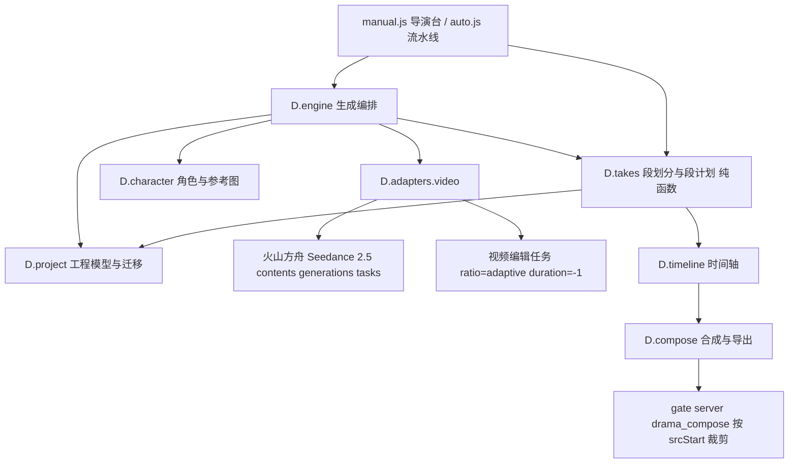

# 短剧生成双模式（逐镜 + 原生多镜）· 技术设计

Feature Name: 2026-09-21-drama-dual-mode-generation
Updated: 2026-09-21

## 描述

在现有多引擎架构上增加「整段模式」生成路径。逐镜模式保持不变，一个分镜一次请求；整段模式把若干连续分镜合并为一个**镜头段**，一次请求生成一整段视频，并由**段计划**给出段内分镜切点，用于时间轴、字幕、合成与导出。

分层的取舍：计算与编排分层，段划分、段计划、提示词组装放在新的纯函数模块 `takes.js`；网络与任务轮询复用 `engine.js` 与 `adapters/video.js`；渲染层只增开关与段视图。段素材的存储沿用 `D.project.cacheRemote` 的资源仓约定，与既有分镜素材同级。

## 架构



分层职责：

- 计算层：`takes.js` 只做纯计算与集合同步，输入工程对象，输出段集合与段计划，无网络与 DOM 依赖。
- 编排层：`engine.js` 新增 `generateTake` 与 `editTake`，复用 `jobs` 并发抑制、状态机与 `save`。
- 适配层：`adapters/video.js` 扩展参考素材类型与任务类型参数，并加入提交前参数校验。
- 视图层：`manual.js` 与 `auto.js` 增加模式开关与段操作入口。
- 合成层：`timeline.js` 追加段边界；`compose.js` 与 `drama_compose` 支持按段内起止裁剪。

## 组件与接口

### 段划分与段计划 `D.takes`（新增 `src/drama/takes.js`）

常量：`MIN_SECONDS = 4`、`TARGET_SECONDS = 15`、`MAX_SECONDS = 30`。

- `limits(project)`：返回 `{ min, target, max }`，`target` 取 `project.takeTarget`，缺失按 15，并夹到 `[min, max]`。
- `group(project, opts)`：按分镜顺序做贪心累加，累计到 `target` 即断段；单段必须 `<= max`；末段 `< min` 时并入前段；单个分镜 `> max` 时返回该分镜的不可分段标记。返回 `[{ shotIds, duration }]`。
- `plan(project, shotIds)`：返回 `[{ sid, seq, start, end }]`，`start` 从 0 累加，末镜 `end` 等于段时长。
- `prompt(project, take)`：组装时间段提示词，见「提示词与参考素材」。
- `refGroups(project, take)`：段内合并角色的参考图分组，复用 `D.character.refGroupsForShot` 的去重与每角色限流规则。
- `sync(project)`：重建 `project.takes`。按 `shotIds` 的签名匹配既有段，命中则保留其 `videoUrl`、`status`、`error`、`fallback`，未命中则新建；重算每段 `duration` 与 `plan`；刷新 `shotId → takeId` 的索引。返回 `project`。
- `takeOf(project, sid)`：按索引返回分镜所属段。
- `segmentOf(project, sid)`：返回 `{ takeId, start, end }`，段内起止时间。
- `markDirty(project, sid)`：当段内分镜的提示词、时长或角色变化时把所属段标 `dirty`。

`group` 与 `plan` 为纯函数，`sync` 对同一工程连续执行两次结果深度相等，保证幂等。

### 生成编排 `D.engine`（扩展 `src/drama/engine.js`）

- `generateTake(project, takeId, opts)`：段级生成。
  1. 取段与段计划；校验段时长落在 `[min, max]`，不合法抛 `D.err("TAKE_RANGE", ...)`。
  2. `jobs["take:" + takeId]` 建立 `AbortController`，段与段内分镜置 `generating`，`save`。
  3. 调 `D.adapters.video.generate`，参数为 `{ prompt, refImages, refGroups, ratio, duration: take.duration, resolution, model, audio }`。
  4. 成功：`take.videoUrl = await cacheRemote(r.url, { role: "takeVideo" })`，段与段内分镜置 `done`，清 `dirty`，`save`。
  5. 失败：段置 `failed` 写入 `error`，保留原 `videoUrl`；`ABORTED` 时回退 `pending`。
- `editTake(project, takeId, sid, opts)`：局段重绘。
  1. 取段与段计划，校验 `take.duration` 落在 `[min, max]`，否则抛 `TAKE_RANGE`。
  2. 取该分镜的段内区间 `[start, end)`，组装编辑意图文本（时间区间 + 修改描述 + 保持不变项）。
  3. 调 `D.adapters.video.edit`，以段素材为参考视频，`ratio` 取 `adaptive`、`duration` 取 `-1`。
  4. 成功：新视频经 `cacheRemote` 后替换 `take.videoUrl`，段计划不变。
- `abortTake(takeId)`：取消段级任务；`abortAll` 同时清理段级任务键。
- 逐镜路径 `generateShot` 与 `generateMany` 不改动，仅在 `generateShot` 入口对 `shotMode === "take"` 抛 `MODE_SHOT_ONLY` 以便视图层防御。

### 视频适配器 `D.adapters.video`（扩展 `src/drama/adapters/video.js`）

- `taskCreate` 扩展参考素材类型：
  - 参考图沿用 `{ type: "image_url", image_url: { url }, role: "reference_image" }`。
  - 参考视频新增 `{ type: "video_url", video_url: { url }, role: "reference_video" }`。
  - 参考音频新增 `{ type: "audio_url", audio_url: { url }, role: "reference_audio" }`。
- `video.edit(opts, onProgress, signal)`：新增入口，提交视频编辑任务，`content` 至少含一个 `reference_video`，文本参数固定 `--ratio adaptive --duration -1`。
- 文本参数拼装 `seedanceText` 扩展：`opts.audio === false` 时追加无声参数；`opts.adaptive === true` 时 `--ratio adaptive`。
- 提交前校验 `assertTaskParams(opts)`：参考视频时长必须落在 `[4, 30]`，视频编辑任务必须 `ratio === "adaptive"` 且 `duration === -1`，首帧任务必须 `ratio === "adaptive"`；违规抛 `D.err("BAD_PARAM", ...)`，避免触发方舟侧报错。
- 分辨率档位收敛到 `480p` 与 `720p`，整段模式默认 `720p`。

### 提示词与参考素材

`takes.prompt(project, take)` 的输出按四段组织：

```text
[一致性约束] 电影级写实摄影，真实皮肤质感，自然光，浅景深。
[角色设定] <复用 character.characterBlock 的固定顺序描述>
[时间段描述] 0-4 秒：<镜1 画面与运镜>；4-9 秒：<镜2 画面与运镜>；……
[锁定项] 保持人物脸型发型服装一致，不新增人物，避免面部与手指畸变。
```

段内台词追加在同一时间段的文字描述中，并在请求有声视频时由模型同次产出对白与口型。

参考素材的组合规则：段内合并所有出场角色，复用 `refGroupsForShot` 的「每角色≤3 张」限制，再按轮询摊平取前 N 张（N 取 9，留出余量给 30 张上限）；角色与参考图的对应说明复用 `refNote` 的文案结构，扩展到多镜场景。

## 数据模型

### 工程（`project.js` 扩展）

- `shotMode`：`"shot"` 或 `"take"`，默认 `"shot"`。
- `takeTarget`：分段目标时长，默认 15，取值夹到 `[4, 30]`。
- `takes`：镜头段数组，元素结构见下。

### 镜头段（`takes[]`）

```text
{ id, seq, shotIds: [sid], duration, plan: [{ sid, start, end }],
  videoUrl, status, error, fallback, dirty, updatedAt }
```

`plan` 是段内起止时间的唯一权威；分镜侧不新增持久字段，避免双数据源漂移。`takes[].videoUrl` 参与 `persistAssets` 与 `hydrateAssets`（新增资源字段 `takeVideo`）。

### 分镜（`project.js` 不变）

`shot` 结构保持不变，段内起止时间通过 `D.takes.segmentOf` 查询。

### 数据迁移（`project.js` 扩展 `migrate`）

在现有迁移后追加：

1. `p.shotMode` 非 `"take"` 时置 `"shot"`。
2. `p.takeTarget` 非数量时置 15，并夹到 `[4, 30]`。
3. `p.takes` 非数组时置 `[]`；随后调用 `D.takes.sync(p)` 重建段集合，保留签名命中的既有段。
4. `persistAssets` 与 `hydrateAssets` 覆盖 `takes[].videoUrl`。

迁移为纯函数且幂等；`sync` 内部不发起网络请求。

## 状态机与联动

- 段状态：`pending` → `generating` → `done` 或 `failed`。
- 段内分镜状态由段状态映射：段 `generating` 时置 `generating`，段 `done` 时置 `done`，段 `failed` 时置 `failed`，段 `pending` 时保留分镜自身的逐镜素材状态。
- `dirty`：段内任一镜的提示词、时长或角色集合变化时置真；局段重绘不清 `dirty`，整段重抽后清零。
- 并发抑制：段级键 `take:<id>` 与镜级键 `<sid>` 分属不同命名空间，两种模式的取消互不干扰。

## 时间轴与合成

### 时间轴（`timeline.js` 扩展）

- `layout(project)` 基本不变，仍按 `shot.duration` 逐镜切分，保证字幕轨与配音轨的既有行为。
- 新增 `takes(project, opts)`：返回 `[{ takeId, seq, start, end, shotIds }]`，用于渲染段边界标记。
- `render` 在画面轨上方增加段边界层 `.dw-take-mark`，`bind` 保留既有 `onSeek` 与 `onSelect` 语义。

### 合成（`compose.js` 与服务端 `drama_compose`）

- 服务端输入扩展：分镜对象新增可选 `srcStart` 与 `srcEnd`。前端在整段模式下把段素材解引为 `videoUrl`，并把 `D.takes.segmentOf` 的起止时间写入 `srcStart` 与 `srcEnd`；`imageUrl`、`audioUrl`、`lipsyncUrl` 沿用既有字段。
- `drama_compose` 对带 `srcStart`/`srcEnd` 的镜头改用 `-ss <srcStart> -t <srcEnd - srcStart>` 从同一输入裁剪，其余镜头维持现状。
- 浏览器合成 `client` 对带 `srcStart` 的镜头在播放时 seek 到 `srcStart`，按 `srcEnd - srcStart` 计数。
- `exportPack` 在整段模式下追加 `takes/take-<seq>.mp4` 与 `takes/takes.json`（段计划清单），既有 `srt`、`csv` 与分镜目录不变。

## 正确性属性

1. 段集合是分镜序列的一个连续、不重叠划分：各段 `shotIds` 并集等于全部分镜，两两交集为空，段内 `seq` 连续。
2. 每段 `duration` 等于段内 `shot.duration` 之和。
3. 除工程总时长不足下限的退化情况外，每段 `duration` 落在 `[4, 30]`。
4. `plan` 与段时长一致：`plan[0].start === 0` 且 `plan[last].end === take.duration`；相邻镜 `end` 与 `start` 相等。
5. 同一分镜在同一时刻仅属于一个段。
6. 局段重绘不改变 `take.duration` 与 `take.plan`。
7. 切换 `shotMode` 不改动任何素材字段。
8. `group`、`plan` 为纯函数；`sync` 与 `migrate` 幂等。

## 错误处理

- 段时长越界：`generateTake` 与 `editTake` 抛 `TAKE_RANGE`，视图层展示分段建议。
- 分镜时长超过硬上限：`group` 标记该分镜不可参与整段生成，视图层禁用发起并提示。
- 参数违规：`assertTaskParams` 在提交前拦截，抛 `BAD_PARAM` 并说明违规项与合法值。
- 接口错误：沿用适配器 `D.err` 与 `shot.error` 的既有约定，段级错误写入 `take.error`。
- 任务超时：沿用 240 次每 3 秒的轮询上限，超时按失败处理并保留段素材。
- 段素材缺失：合成或导出前提示待补齐的镜头段，保留其余产物。
- 模型未配置：按「未配置回退」产出占位段素材并标注 `fallback`。

## 测试策略

- 单元测试（`tests/drama.test.js` 扩展）：`group` 的边界（总时长小于下限、恰好命中目标、候选超硬上限必拆、末段小于下限并入前段、单镜超硬上限）；`plan` 的连续性与边界；`sync` 的幂等与段素材保留；`migrate` 对旧工程的 `shotMode`、`takeTarget`、`takes` 补齐与幂等；`assertTaskParams` 的参数校验矩阵。
- DOM 端到端（`tests/drama-e2e.js` 扩展）：切换生成模式并持久化；段视图渲染与段边界标记；发起整段生成后段素材落盘且段内分镜置 `done`；局段重绘替换段素材且段计划不变；切换模式后素材保留。
- 店门测试（`gate/test_gate` 扩展）：`drama_compose` 对带 `srcStart`/`srcEnd` 的镜头裁剪路径。
- 真实模型冒烟：以用户自备火山方舟 Key 手工验证整段生成与局段重绘各一次，不纳入自动化流水线。

现有测试基线须保持通过。

## 实施顺序

1. 新增 `src/drama/takes.js`（`limits`、`group`、`plan`、`sync`、`takeOf`、`segmentOf`）与单元测试。
2. 扩展 `project.js`：`shotMode`、`takeTarget`、`takes` 迁移，`persistAssets` 与 `hydrateAssets` 覆盖段素材。
3. 扩展 `adapters/video.js`：参考素材类型、`edit` 入口、`audio` 与 `adaptive` 参数、`assertTaskParams`。
4. 扩展 `engine.js`：`generateTake`、`editTake`、`abortTake` 与段级状态联动。
5. 扩展 `takes.js`：`prompt` 与 `refGroups` 的提示词与参考素材组装。
6. 扩展视图层 `manual.js` 与 `auto.js`：模式开关、段视图、整段生成与局段重绘入口。
7. 扩展 `timeline.js` 段边界与 `compose.js`、`gate/server.py` 的段内裁剪与导出包。
8. 回归全部测试、更新文档与记忆、提交推送。

## 参考

[^1]: 火山引擎 · 创建视频生成任务 API，`POST /api/v3/contents/generations/tasks`，含 Seedance 2.5 任务类型与参数约束。
[^2]: 火山引擎 · Doubao Seedance 2.5 教程，时间段提示、时间戳定向编辑与任务类型限制。
[^3]: `.monkeycode/specs/2026-09-17-drama-workbench-pro/design.md`，工作台专业范式的既有分层与契约。
