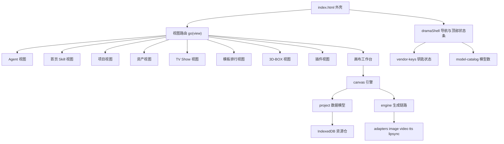

# 小龙虾完全 LibTV 化 · 技术设计

Feature Name: 2026-09-22-libtv-full-parity
Updated: 2026-09-22

## Description

把店门（`/dian/`）从「对话助手外壳 + 逐镜导演台」重构为 LibTV 形态：左侧统一导航（新建项目 / Agent / 首页 / 项目 / 资产 / TV Show / 模板排行 / 3D-BOX / 插件），首页为 Skill 驱动的灵感输入 + Skill 墙，工程打开后默认进入节点画布，工程数据模型由「单一画布 + 分镜表」升级为「多画布 + 节点图」。

本次复用已有 `src/drama/canvas.js` 节点引擎（`NODE_TYPES`、`addNode`、`addEdge`、`topoOrder`、`buildPrompt` 已存在），在其上补齐多画布、新节点类型与节点动作，并新建 LibTV 外壳与各页视图。

## 已确认设计决策

- **D5 旧工程分镜**：首次打开含分镜的旧工程时，自动把每个分镜转成文本 / 图片 / 视频节点并连边铺开；`p.shots` 数据保留不删。
- **D6 3D-BOX 上下文**：3D-BOX 独立页内置工程选择器，选工程后在页内操作，结果写回该工程。
- **D7 首页提交**：提交灵感或点选 Skill 后，建工程 + 按 Skill 自动铺好首个节点 + 直接发起生成，对齐 LibTV 行为。

## Architecture



### 分层

- **外壳层**：`index.html` 骨架 + 新建 `src/drama/shell.js`。负责 LibTV 左侧导航、顶部状态条、视图注册与切换，包裹现有 `XLX.app.go` 路由。
- **视图层**：每页一个模块，统一导出 `mount(container, opts)`。新页 `home`、`projects`、`assets`、`tvshow`、`ranking`、`plugin`；改造页 `box3d`、`workbench`。
- **画布层**：`src/drama/canvas.js` 在多画布数据上运行，提供节点类型注册、连线规则、拓扑生成。
- **数据层**：`src/drama/project.js` 提供工程读写、多画布规范化、旧数据迁移；大资源仍走 IndexedDB。
- **生成层**：`src/drama/engine.js` + `src/drama/adapters/*`，本轮不改协议，只换触发入口。

## Components and Interfaces

### 1. `src/drama/shell.js`（新建）

- `NAV`：LibTV 导航定义，含 `id / label / icon / badge / group`。
- `mount(container)`：渲染左侧导航与顶部状态条，绑定点击切换到 `XLX.app.go(id)`。
- `status()`：读取 `XLX.vendorKeys` 已配置厂商数与 `XLX.modelCatalog` 模型数，渲染顶部状态条。
- `setActive(id)`：同步导航选中态；`XLX.app.go` 每次切换后调用。

导航定义（对应 LibTV 左侧）：

| id | label | badge |
|---|---|---|
| newProject | 新建项目（主按钮） | — |
| agent | Agent | — |
| home | 首页 | — |
| projects | 项目 | — |
| assets | 资产 | — |
| tvshow | TV Show | 全网爆款 |
| ranking | 创作者挑战赛 | 王者大赛 |
| box3d | 3D-BOX | — |
| plugin | 插件 | — |

`settings / memory / download` 从主导航移除，收进顶部账户菜单。

### 2. `XLX.app` 路由（改造 `index.html:4315`）

- `VIEWS` 由 `["chat","market","studio","dramaHome","drama","auto","makeup","tools","memory","download","settings"]` 改为 `["agent","home","projects","assets","tvshow","ranking","box3d","plugin","studio","tools","memory","download","settings","drama"]`，其中 `drama` 为画布工作台视图。
- `names` 元数据表同步更新标题与副标题。
- `go(view)` 在切换后调用 `XLX.dramaShell.setActive(view)`；未知 view 回退 `home`。

### 3. 视图模块

| 模块 | 文件 | 来源 | 职责 |
|---|---|---|---|
| Agent | 现有对话引擎 | `index.html` | 原样保留，仅容器 id 归属 `agent` |
| 首页 Skill | `src/drama/home.js` 重写 | 技能清单 `XLX.SKILLS` | 灵感输入框 + 分栏 + 分类条 + Skill 墙 |
| 项目 | `src/drama/projects.js` 新建 | `home.js` 工程网格部分 | 工程卡网格 + 搜索 + 回收站 + 新建文件夹 |
| 资产 | `src/drama/assets.js` 新建 | `makeup.js` + `character.js` | 三视图 / 场景卡 / 多参考 + 资产网格 |
| TV Show | `src/drama/tvshow.js` 新建 | `auto.js` 产物 | 成片库网格 + 空态入口 |
| 模板排行 | `src/drama/ranking.js` 新建 | `XLX.SKILLS` + `templates.js` | 排行榜列表 |
| 3D-BOX | `src/drama/box3d.js` 加页面壳 | 现有引擎 | 五项工具页 |
| 插件 | `src/drama/plugin.js` 新建 | `studio`/`tools`/`download` | 三入口聚合 |
| 画布工作台 | `src/drama/manual.js` 改造 | `manual.js` + `canvas.js` | 画布宿主：顶栏 / 画布 / 详情面板 / 工具条 |

统一接口：`mount(container, opts) -> { destroy() }`；`opts` 至少含 `{ projectId }`。

### 4. `src/drama/canvas.js`（扩展）

新增多画布接口：

- `listCanvases(p)`：返回 `p.canvases`。
- `activeCanvas(p)`：按 `p.activeCanvasId` 取画布，缺失时取首张并回写。
- `addCanvas(p, name)` / `removeCanvas(p, cid)` / `renameCanvas(p, cid, name)` / `setActiveCanvas(p, cid)`。
- `ensure(p)` 改为对**当前画布**规范化；节点/连线规则不变。

新增节点类型（追加到 `NODE_TYPES`，`canvas.js:12`）：

| type | label | in | out | multi |
|---|---|---|---|---|
| lipsync | 口型 | `["video","audio"]` | `video` | true |
| asset | 资产 | `[]` | `image` | false |

节点动作：`NODE_TYPES[t].actions` 声明该类型可用动作，至少含 `redraw`（重绘）与 `hires`（高清）；工作台按动作渲染「尝试」区。

### 5. `src/drama/manual.js` → 画布工作台

- 移除 `mode` 三态（`board` / `node` / `box`，`manual.js:137`）与故事板布局（分镜列表 / 时间轴 / 属性面板三栏）。
- 顶部左：工程下拉、画布下拉、缩放控件、面板开关。
- 顶部右：分享、历史、状态条（由 `shell.status()` 提供）。
- 中部：`canvas.mount` 画布。
- 右侧：详情面板，承载逐镜精修字段（提示词 / 台词 / 运镜 / 时长 / 入点 / 出点）。
- 底部：浮动工具条，添加节点 / 生成 / 合成导出。
- 视频节点内容区：播放 / 暂停 / 逐帧前后 / 入出点设置。

### 6. `src/drama/project.js`（数据模型 + 迁移）

规范化函数（`project.js:476` 处）由单画布改为多画布，新增 `migrate(p)`：

- 单画布 → 多画布：存在 `p.canvas` 且无 `p.canvases` 时，包成 `[{ id:"c1", name:"画布 1", ...p.canvas }]`，`p.activeCanvasId="c1"`，删除 `p.canvas`。
- 分镜 → 节点：仅当目标画布无节点且 `p.shots.length` 时执行；每个分镜生成 `text` 节点（提示词/台词）与 `image` 节点并连边，`p.shots[i].video` 存在时追加 `video` 节点，按网格坐标铺开。
- 迁移幂等：已有多画布或已有节点时不重复执行。

## Data Models

```js
project = {
  id, title, genre, engine, script, style, subtitle, bgm, output, compliance, source,
  characters: [ { id, name, identity, appearance, details, refImages, views } ],
  shots: [ /* 旧数据，保留不删；迁移后画布与之一致 */ ],
  canvases: [ { id, name, v:1, nodes: [], edges: [], view: { x, y, k }, updatedAt } ],
  activeCanvasId,
  box3d, assets
}

node = { id, type, title, x, y, data:{}, out:"", status:"idle", error:"" }
edge = { id, from, to }
```

存储键保持：工程列表 `xlx_drama_projects`（`project.js:292` 附近的 `all/writeAll`），大资源 IndexedDB；技能数据仍为 `XLX.SKILLS`（`index.html:1230`）。

## Correctness Properties

1. **无数据丢失**：迁移前后 `p.shots`、`p.characters`、`p.box3d`、`p.assets` 内容不变；迁移只增不改。
2. **迁移幂等**：对同一工程重复执行 `migrate(p)`，`p.canvases` 与节点集合不再变化。
3. **画布隔离**：切换画布只改 `activeCanvasId`，各画布 `nodes/edges/view` 互不影响。
4. **连线合法**：沿用现有规则，`multi:false` 的输入口最多一条入边、无环（`canvas.js:107`、`canvas.js:114`）。
5. **导航一致**：任意时刻有且仅有一个导航项处于选中态，且与当前视图一致。
6. **视图可挂载**：每个视图模块 `mount` 返回 `destroy`，切换视图时调用 `destroy` 释放监听。

## Error Handling

- 未知视图 id：回退渲染首页，并在控制台记录一次警告。
- 画布缺失或 `activeCanvasId` 悬空：自动补建画布并回写，提示一次 toast。
- 删除最后一张画布：阻止操作并提示「至少保留一张画布」。
- 节点生成失败：写回 `node.status="failed"` 与 `node.error`，详情面板展示可重试入口，不清空既有素材。
- 顶部状态条读取钥匙/模型失败：降级显示「未配置」，不阻塞导航。

## Test Strategy

- **单元**：新增 `tests/shell.test.js`（导航定义、选中态）、`tests/canvas-multi.test.js`（多画布增删改切、隔离、最后一张保护）、`tests/project-migrate.test.js`（单画布迁移、分镜转节点、幂等）。既有 `tests/drama.test.js`、`tests/canvas.test.js`、`tests/makeup.test.js`、`tests/box3d.test.js`、`tests/vendor-keys.test.js`、`tests/model-pool.test.js` 保持通过。
- **契约**：`tests/adapters-http.test.js` 不改，继续跑 12 项。
- **端到端**：`tests/drama-e2e.js` 更新为 LibTV 导航 id 与画布入口；新增首页→新建→画布→出片主链路的烟测。
- **命令**：单元 `cd /workspace/xiaolongxia-ai && node --test tests/*.test.js`；契约 `NODE_PATH="$(npm root -g)" node --test tests/adapters-http.test.js`；e2e `NODE_PATH="$(npm root -g)" node tests/drama-e2e.js`；网关 `cd gate && python3 -m unittest test_gate`。

## References

[^1]: (index.html#L4315) - 现有视图注册与路由 [index.html](index.html)
[^2]: (index.html#L1230) - 技能清单 `XLX.SKILLS` [index.html](index.html)
[^3]: (src/drama/canvas.js#L12) - 节点类型注册表 `NODE_TYPES` [canvas.js](src/drama/canvas.js)
[^4]: (src/drama/project.js#L476) - 工程规范化与画布初始化 [project.js](src/drama/project.js)
[^5]: (src/drama/manual.js#L137) - 现有三态导演台布局 [manual.js](src/drama/manual.js)
[^6]: (src/drama/home.js) - 现项目中心 [home.js](src/drama/home.js)
[^7]: (.monkeycode/specs/2026-09-22-libtv-full-parity/requirements.md) - 配套需求文档
