**电商工作台 整体布局与设计（详细版）**

铜龙电商 · 小龙虾平台

Feature Name: ecom-workbench

Updated: 2026-09-27

Status: 设计稿（待确认后进入实施）

Feature Name: ecom-workbench

Updated: 2026-09-27

Status: 设计稿（待确认后进入实施）

本文件是电商工作台的完整布局与设计文档，合并并细化了同目录的 requirements.md 与 design.md。实施以此文件为准。

# **0. 文档说明**

<table><tr><td>
<strong>项</strong>
</td><td>
<strong>内容</strong>
</td></tr><tr><td>
产品
</td><td>
铜龙电商 · 小龙虾平台
</td></tr><tr><td>
新增分区
</td><td>
电商工作台（与短剧工作台并列）
</td></tr><tr><td>
定位
</td><td>
自用电商内容工作台：采集下载、素材处理、AI 生成、搬家铺货、合规检测、多店铺与批量任务
</td></tr><tr><td>
不做
</td><td>
完整 ERP 的订单、库存、财务、发货核算（按需对接外部工具或平台后台）
</td></tr><tr><td>
平台策略
</td><td>
全量走平台官方开放接口 + 店铺授权
</td></tr><tr><td>
目标平台
</td><td>
淘宝、抖音小店、拼多多、快手小店、跨境 TikTok Shop
</td></tr><tr><td>
源平台
</td><td>
1688、淘宝、拼多多
</td></tr><tr><td>
量级
</td><td>
单批铺货几十到几百个商品
</td></tr><tr><td>
关键能力
</td><td>
一键铺货、批量改价、批量上下架、定时上架、店群多店聚合、合规检测
</td></tr></table>

# **1. 背景与目标**

## **1.1 背景**

当前小龙虾以短剧工作台为核心，已具备生成适配器（BYOK）、画布流水线、资产库、参考图机制与技能引擎。电商运营侧需要一条「采集货源商品 → 加工素材 → 铺货上架」的流水线，替代人工复制粘贴与在多平台后台之间反复切换。

## **1.2 产品定位**

电商工作台是集成在小龙虾内的第二个工作分区，与短剧工作台共享底层能力，导航与数据命名空间相互隔离。

## **1.3 目标**

1. 打通「采集 → 处理 → 生成 → 上架」的闭环，单平台先跑通，再横向扩平台。
2. 支持批量与定时作业，适配几十到几百量级的铺货。
3. 支持多店铺聚合（店群），一个工作台管理多平台多店铺。
4. 内建合规检测，上架前拦截违禁词、侵权与重复铺货风险。
5. 复用短剧的生成引擎与资产体系，避免重复建设。
6. 不实现完整 ERP：订单、库存、财务、打单发货核算不在本工作台范围。
7. 不实现仓储（WMS）与物流面单系统。
8. 不以绕过平台规则的方式获取数据或上架。

## **1.4 非目标**

## **1.5 参照产品与能力来源**

<table><tr><td>
<strong>参照</strong>
</td><td>
<strong>借鉴能力</strong>
</td></tr><tr><td>
盘古上货
</td><td>
跨境上货、批量搬运
</td></tr><tr><td>
甩手工具箱（甩手掌柜系列）
</td><td>
抓取商品、店铺复制、抓取图片、制作数据包、主图视频、上货助理、下单助手
</td></tr><tr><td>
癞蛤蟆电商工具箱
</td><td>
数据分析、竞品监控、关键词优化、店铺诊断、批量操作
</td></tr><tr><td>
至尊宝电商工具箱
</td><td>
批量铺货与商品管理
</td></tr><tr><td>
牛牛搬家 / 妙手 / 智淘分销 / 贝塔上货
</td><td>
采集上货一体、整店搬家、批量改价改库存、重复铺货检测、店群管理
</td></tr><tr><td>
聚水潭 ERP / 极速上货
</td><td>
一键铺货、云商品库/图片库、批量改价、自动上下架、多平台对接、多店铺报表
</td></tr></table>

# **2. 总体布局**

## **2.1 顶层分区**

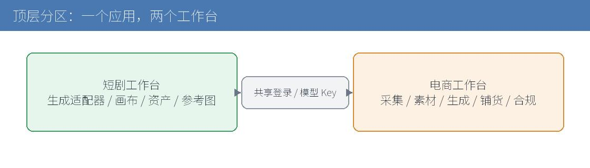  
图 1 顶层分区：一个应用，两个工作台

小龙虾顶端提供工作台切换：短剧工作台 | 电商工作台。两个分区共享登录态、模型 Key 设置与资产库；导航项与数据命名空间分离。

## **2.2 电商工作台信息架构**

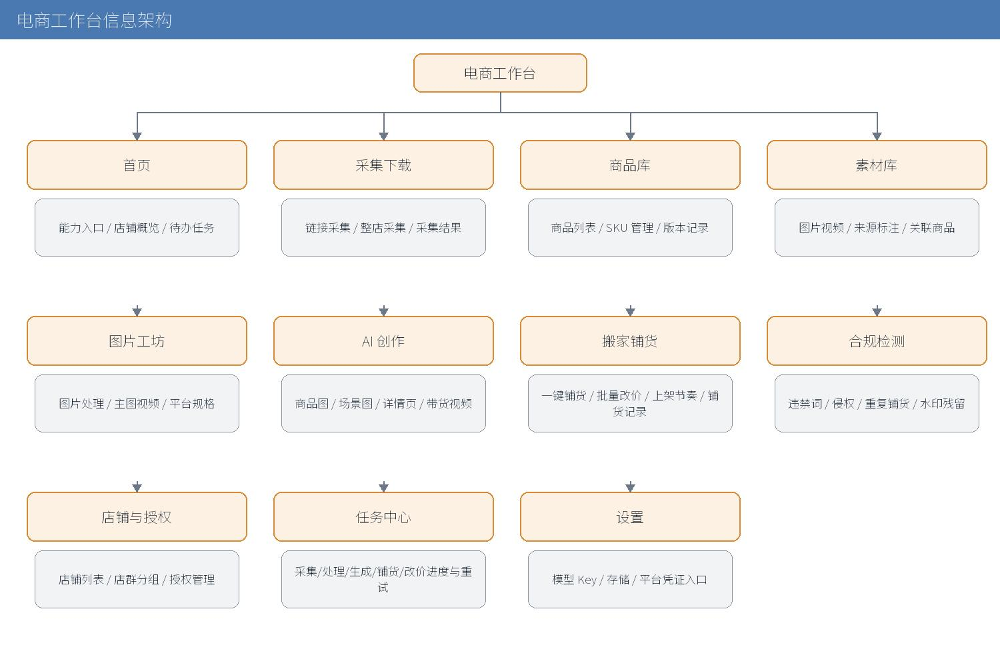  
图 2 电商工作台信息架构

电商工作台

├─ 首页              能力入口、店铺概览、待办任务、最近采集/铺货

├─ 采集下载

│   ├─ 链接采集       单商品链接 → 抓取商品

│   ├─ 整店采集       店铺地址 → 批量抓取

│   └─ 采集结果       待编辑列表、字段检查、批量入库

├─ 商品库

│   ├─ 商品列表       筛选、批量编辑、批量删除

│   ├─ SKU 管理       规格、价格、库存、条码

│   └─ 版本记录       关键字段修改历史

├─ 素材库             图片/视频、来源标注、关联商品、批量处理入口

├─ 图片工坊

│   ├─ 图片处理       抠图、白底、背景替换、去重、尺寸比例

│   ├─ 主图视频       图片转主图短视频

│   └─ 平台规格预设   淘宝 1:1、抖音 9:16、Amazon 白底 等

├─ AI 创作            商品图、场景图、详情页、模特图、带货视频

├─ 搬家铺货

│   ├─ 一键铺货       向导式：选品 → 选店 → 策略 → 预检 → 提交

│   ├─ 批量改价       公式改价、批量上下架

│   ├─ 上架节奏       每日条数、分时上架

│   └─ 铺货记录       结果、失败原因、重试

├─ 合规检测           违禁词、侵权、重复铺货、水印残留

├─ 店铺与授权

│   ├─ 店铺列表       平台、账号、授权状态

│   ├─ 店群分组       分组管理、跨店聚合视图

│   └─ 授权管理       重新授权、凭证状态

├─ 任务中心           采集/处理/生成/铺货/改价任务进度与重试

└─ 设置               模型 Key、存储、平台凭证入口

## **2.3 模块职责与首屏**

<table><tr><td>
<strong>模块</strong>
</td><td>
<strong>职责</strong>
</td><td>
<strong>首屏内容</strong>
</td></tr><tr><td>
首页
</td><td>
聚合入口与概览
</td><td>
五个能力卡（采集/图片工坊/AI 创作/搬家铺货/合规）、店铺概览、待办任务
</td></tr><tr><td>
采集下载
</td><td>
拉取商品与素材
</td><td>
地址输入框、源平台选择、采集进度、结果表
</td></tr><tr><td>
商品库
</td><td>
结构化商品数据
</td><td>
筛选栏、商品列表、批量操作栏
</td></tr><tr><td>
素材库
</td><td>
图片视频素材
</td><td>
瀑布流/表格、来源与关联商品、批处理入口
</td></tr><tr><td>
图片工坊
</td><td>
素材加工
</td><td>
素材选择、处理器列表、平台规格预设、预览
</td></tr><tr><td>
AI 创作
</td><td>
生成电商素材
</td><td>
商品选择、生成类型、参考图、生成队列
</td></tr><tr><td>
搬家铺货
</td><td>
转换与上架
</td><td>
一键铺货向导、改价规则、铺货记录
</td></tr><tr><td>
合规检测
</td><td>
风险拦截
</td><td>
检测队列、命中详情、放行/拦截
</td></tr><tr><td>
店铺与授权
</td><td>
多店管理
</td><td>
店铺卡片、店群分组、授权状态
</td></tr><tr><td>
任务中心
</td><td>
作业跟踪
</td><td>
任务列表、进度、失败项与重试
</td></tr><tr><td>
设置
</td><td>
配置
</td><td>
模型 Key、存储、平台凭证说明
</td></tr></table>

## **2.4 导航与路由映射**

沿用小龙虾既有的视图路由机制（VIEWS 注册、renderView/go 分发）。电商分区新增视图键：

<table><tr><td>
<strong>视图键</strong>
</td><td>
<strong>页面</strong>
</td></tr><tr><td>
ecomHome
</td><td>
电商首页
</td></tr><tr><td>
ecomCollect
</td><td>
采集下载
</td></tr><tr><td>
ecomProducts
</td><td>
商品库
</td></tr><tr><td>
ecomAssets
</td><td>
素材库
</td></tr><tr><td>
ecomImage
</td><td>
图片工坊
</td></tr><tr><td>
ecomAi
</td><td>
AI 创作
</td></tr><tr><td>
ecomPublish
</td><td>
搬家铺货
</td></tr><tr><td>
ecomCompliance
</td><td>
合规检测
</td></tr><tr><td>
ecomShops
</td><td>
店铺与授权
</td></tr><tr><td>
ecomTasks
</td><td>
任务中心
</td></tr></table>

# **3. 架构设计**

## **3.1 分层架构**

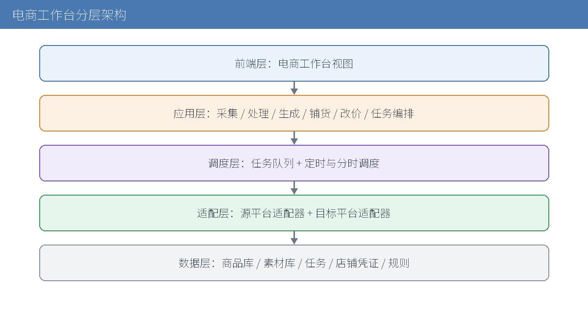  
图 3 电商工作台分层架构

## **3.2 模块划分**

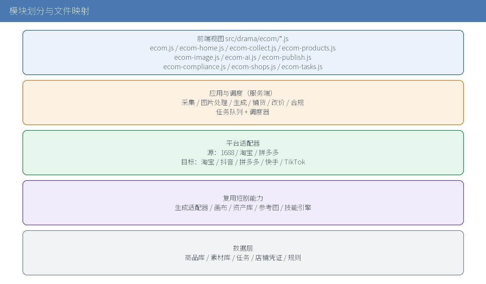  
图 4 模块划分与文件映射

<table><tr><td>
<strong>层</strong>
</td><td>
<strong>模块</strong>
</td><td>
<strong>说明</strong>
</td></tr><tr><td>
前端
</td><td>
src/drama/ecom/*.js
</td><td>
电商视图与交互，注册到既有外壳
</td></tr><tr><td>
应用
</td><td>
服务端业务编排
</td><td>
采集、图片处理、生成、铺货、改价、合规
</td></tr><tr><td>
调度
</td><td>
任务队列 + 调度器
</td><td>
并发控制、定时与分时、失败重试
</td></tr><tr><td>
适配
</td><td>
源/目标平台适配器
</td><td>
每平台一个实现，统一契约
</td></tr><tr><td>
引擎
</td><td>
复用短剧能力
</td><td>
生成适配器、画布、资产、参考图
</td></tr><tr><td>
数据
</td><td>
商品/素材/任务/凭证/规则
</td><td>
服务端持久化 + 前端缓存
</td></tr></table>

## **3.3 与短剧工作台的复用与隔离**

复用：

<table><tr><td>
<strong>复用项</strong>
</td><td>
<strong>来源</strong>
</td></tr><tr><td>
资产转存与水合
</td><td>
src/drama/project.js（toRef/hydrateRef/cacheRemote）
</td></tr><tr><td>
本地资产库
</td><td>
src/drama/project.js IndexedDB
</td></tr><tr><td>
生成适配器
</td><td>
src/drama/adapters/*.js、src/drama/config.js
</td></tr><tr><td>
参考图机制
</td><td>
src/drama/character.js 参考图链路
</td></tr><tr><td>
画布流水线
</td><td>
src/drama/canvas.js
</td></tr><tr><td>
技能流水线
</td><td>
src/drama/skill.js（新增 planEcom）
</td></tr><tr><td>
资产上传通道
</td><td>
gate/server.py（/dian/api/drama/asset）
</td></tr><tr><td>
登录会话
</td><td>
gate 会话
</td></tr></table>

隔离：电商数据的存储键、接口前缀、视图键均带 ecom 命名空间。

## **3.4 部署与反向代理**

- 前端沿用静态站架构，经反向代理访问后端 /api 前缀。
- 后端沿用 Python 技术栈，承载业务编排、调度与适配器。
- 平台凭证与授权仅存服务端。
- 复用现有部署方式（同步静态文件 + 重启后端服务）。

# **4. 平台接入方案（官方 API）**

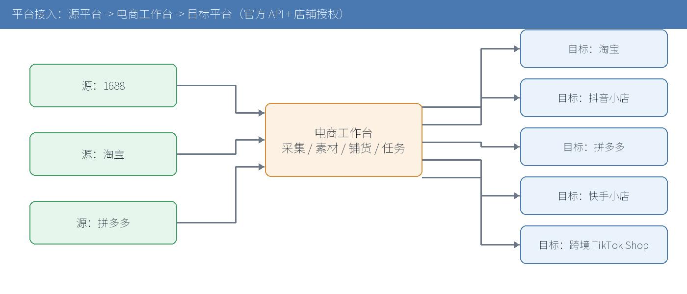  
图 5 平台接入：源平台 -> 电商工作台 -> 目标平台

## **4.1 源平台适配器**

<table><tr><td>
<strong>平台</strong>
</td><td>
<strong>开放平台</strong>
</td><td>
<strong>采集能力</strong>
</td><td>
<strong>说明</strong>
</td></tr><tr><td>
1688
</td><td>
阿里巴巴开放平台
</td><td>
商品详情、SKU、主图、详情
</td><td>
主要货源地
</td></tr><tr><td>
淘宝
</td><td>
淘宝开放平台
</td><td>
商品详情（自店或有授权）
</td><td>
需应用与授权
</td></tr><tr><td>
拼多多
</td><td>
拼多多开放平台
</td><td>
商品详情（自店或有授权）
</td><td>
需应用与授权
</td></tr></table>

## **4.2 目标平台适配器**

<table><tr><td>
<strong>平台</strong>
</td><td>
<strong>开放平台</strong>
</td><td>
<strong>铺货能力</strong>
</td><td>
<strong>说明</strong>
</td></tr><tr><td>
淘宝
</td><td>
淘宝开放平台
</td><td>
商品发布、改价、上下架
</td><td>
需应用与类目权限
</td></tr><tr><td>
抖音小店
</td><td>
抖店开放平台
</td><td>
商品发布、改价、上下架
</td><td>
需应用与类目资质
</td></tr><tr><td>
拼多多
</td><td>
拼多多开放平台
</td><td>
商品发布、改价、上下架
</td><td>
需应用与类目权限
</td></tr><tr><td>
快手小店
</td><td>
快手小店开放平台
</td><td>
商品发布、改价、上下架
</td><td>
需应用与类目权限
</td></tr><tr><td>
跨境 TikTok Shop
</td><td>
TikTok Shop Partner Center
</td><td>
商品发布、改价、上下架
</td><td>
跨境，需开发者申请与区域权限
</td></tr></table>

## **4.3 接入前提**

9. 在各平台开发者平台注册开发者账号。
10. 创建应用并通过审核，申请所需权限点（商品读取/发布/修改）。
11. 自用场景：用自有应用授权自有店铺；如平台要求服务商资质，按平台规则申请。
12. 同步目标平台的类目树、运费模板与类目资质要求，作为铺货预检依据。
13. 应用级凭证（appkey/secret）与店铺级凭证（access\_token/refresh\_token）均加密存于服务端。
14. 采用平台标准 OAuth 授权流程，授权回调写入店铺记录。
15. 维护 token 刷新任务；刷新失败标记店铺为 expired 并提示重新授权。
16. 前端仅展示授权状态，不接触原始凭证。
17. 按平台配置 QPS 与日调用配额，任务队列按平台限流。
18. 请求失败按错误类型退避重试（网络错误重试，业务错误不重试）。
19. 归一化错误码，映射为可读类别：类目资质缺失、违禁词、图片尺寸不符、SKU 不完整、限流、授权失效。
20. 发布类接口采用异步结果获取（回调或轮询），任务记录远端 id。

## **4.4 凭证与授权**

## **4.5 限流、配额与错误处理**

## **4.6 适配器统一契约**

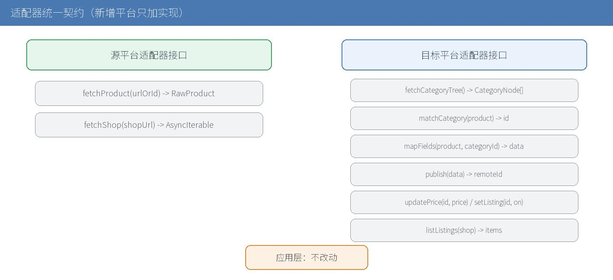  
图 6 适配器统一契约

源平台适配器：

fetchProduct(urlOrId, ctx) -> RawProduct

fetchShop(shopUrl, opts, ctx) -> AsyncIterable<RawProduct>

目标平台适配器：

fetchCategoryTree(ctx) -> CategoryNode[]

matchCategory(product) -> { categoryId, confidence }

mapFields(product, categoryId) -> { data, missing[] }

publish(data, shopAuth) -> { remoteId }

updatePrice(remoteId, price, shopAuth) -> void

setListing(remoteId, on, shopAuth) -> void

listListings(shopAuth, cursor) -> { items, cursor }

约束：新增平台只新增适配器实现，不改应用层。适配器以可注入方式注册，便于用 mock 做契约测试。

# **5. 数据模型**

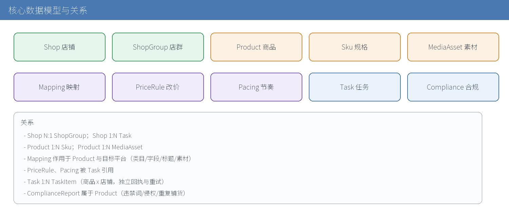  
图 7 核心数据模型与关系

## **5.1 Product 商品**

<table><tr><td>
<strong>字段</strong>
</td><td>
<strong>类型</strong>
</td><td>
<strong>说明</strong>
</td></tr><tr><td>
id
</td><td>
string
</td><td>
本地主键
</td></tr><tr><td>
title
</td><td>
string
</td><td>
标题
</td></tr><tr><td>
attributes
</td><td>
object
</td><td>
属性键值对
</td></tr><tr><td>
category
</td><td>
string
</td><td>
本地类目
</td></tr><tr><td>
price
</td><td>
number
</td><td>
商品库源价
</td></tr><tr><td>
stock
</td><td>
number
</td><td>
商品库源库存
</td></tr><tr><td>
skus
</td><td>
Sku[]
</td><td>
规格列表
</td></tr><tr><td>
mediaIds
</td><td>
string[]
</td><td>
关联素材
</td></tr><tr><td>
sourcePlatform
</td><td>
string
</td><td>
来源平台
</td></tr><tr><td>
sourceUrl
</td><td>
string
</td><td>
来源地址
</td></tr><tr><td>
status
</td><td>
enum
</td><td>
collect/pending/publishing/listed/error
</td></tr><tr><td>
versions
</td><td>
object[]
</td><td>
关键字段修改前版本
</td></tr><tr><td>
createdAt/updatedAt
</td><td>
number
</td><td>
时间戳
</td></tr></table>

## **5.2 Sku**

<table><tr><td>
<strong>字段</strong>
</td><td>
<strong>说明</strong>
</td></tr><tr><td>
id
</td><td>
主键
</td></tr><tr><td>
specs
</td><td>
规格键值（如 颜色/尺码）
</td></tr><tr><td>
price
</td><td>
价格
</td></tr><tr><td>
stock
</td><td>
库存
</td></tr><tr><td>
barcode
</td><td>
条码
</td></tr><tr><td>
mediaId
</td><td>
规格图
</td></tr><tr><td>
enabled
</td><td>
是否启用
</td></tr></table>

## **5.3 MediaAsset 素材**

<table><tr><td>
<strong>字段</strong>
</td><td>
<strong>说明</strong>
</td></tr><tr><td>
id
</td><td>
主键
</td></tr><tr><td>
type
</td><td>
image / video
</td></tr><tr><td>
ref
</td><td>
asset: 引用或远端地址
</td></tr><tr><td>
source
</td><td>
collect / ai / edit
</td></tr><tr><td>
linkedProductId
</td><td>
关联商品
</td></tr><tr><td>
platform
</td><td>
来源或目标平台
</td></tr><tr><td>
width/height
</td><td>
尺寸
</td></tr><tr><td>
createdAt
</td><td>
时间戳
</td></tr></table>

## **5.4 Shop 店铺**

<table><tr><td>
<strong>字段</strong>
</td><td>
<strong>说明</strong>
</td></tr><tr><td>
id
</td><td>
主键
</td></tr><tr><td>
platform
</td><td>
平台标识
</td></tr><tr><td>
account
</td><td>
账号
</td></tr><tr><td>
authRef
</td><td>
服务端凭证引用
</td></tr><tr><td>
status
</td><td>
normal / expired
</td></tr><tr><td>
groupId
</td><td>
所属店群
</td></tr><tr><td>
addedAt
</td><td>
时间
</td></tr></table>

## **5.5 ShopGroup 店群**

<table><tr><td>
<strong>字段</strong>
</td><td>
<strong>说明</strong>
</td></tr><tr><td>
id
</td><td>
主键
</td></tr><tr><td>
name
</td><td>
分组名
</td></tr><tr><td>
shopIds
</td><td>
店铺列表
</td></tr><tr><td>
note
</td><td>
备注
</td></tr></table>

## **5.6 Mapping 铺货映射**

<table><tr><td>
<strong>字段</strong>
</td><td>
<strong>说明</strong>
</td></tr><tr><td>
id
</td><td>
主键
</td></tr><tr><td>
sourcePlatform/targetPlatform
</td><td>
源与目标平台
</td></tr><tr><td>
categoryRules
</td><td>
源类目 → 目标类目规则
</td></tr><tr><td>
fieldPairs
</td><td>
源字段 → 目标字段
</td></tr><tr><td>
titleRules
</td><td>
标题替换规则（B 端词 → C 端词、前后缀）
</td></tr><tr><td>
mediaRules
</td><td>
素材处理规则（去重、尺寸）
</td></tr><tr><td>
updatedAt
</td><td>
时间
</td></tr></table>

## **5.7 PriceRule 改价规则**

<table><tr><td>
<strong>字段</strong>
</td><td>
<strong>说明</strong>
</td></tr><tr><td>
id
</td><td>
主键
</td></tr><tr><td>
name
</td><td>
名称
</td></tr><tr><td>
applyTo
</td><td>
source（改商品库源价）/ listing（改已上架商品）
</td></tr><tr><td>
base
</td><td>
cost / current
</td></tr><tr><td>
add
</td><td>
固定加价
</td></tr><tr><td>
percent
</td><td>
百分比
</td></tr><tr><td>
round
</td><td>
none / to9 / to99 / int
</td></tr><tr><td>
min/max
</td><td>
夹取区间
</td></tr><tr><td>
scope
</td><td>
适用店铺/店群/类目
</td></tr><tr><td>
updatedAt
</td><td>
时间
</td></tr></table>

## **5.8 Pacing 上架节奏**

<table><tr><td>
<strong>字段</strong>
</td><td>
<strong>说明</strong>
</td></tr><tr><td>
id
</td><td>
主键
</td></tr><tr><td>
perDay
</td><td>
每日上架条数
</td></tr><tr><td>
windowStart/windowEnd
</td><td>
上架时间窗
</td></tr><tr><td>
batchSize
</td><td>
每批条数
</td></tr></table>

## **5.9 Task 任务**

<table><tr><td>
<strong>字段</strong>
</td><td>
<strong>说明</strong>
</td></tr><tr><td>
id
</td><td>
主键
</td></tr><tr><td>
kind
</td><td>
collect/process/generate/publish/priceAdjust/listing
</td></tr><tr><td>
title
</td><td>
标题
</td></tr><tr><td>
scope
</td><td>
productIds / shopIds / groupIds
</td></tr><tr><td>
strategyRef
</td><td>
mappingId / priceRuleId / pacingId
</td></tr><tr><td>
schedule
</td><td>
mode（now/at/recurring）+ at/cron/window
</td></tr><tr><td>
retry
</td><td>
max + backoff
</td></tr><tr><td>
state
</td><td>
见状态机
</td></tr><tr><td>
progress
</td><td>
total/pending/running/success/failed
</td></tr><tr><td>
items
</td><td>
每项：productId/shopId/state/remoteId/error/attempts
</td></tr><tr><td>
createdAt/startedAt/finishedAt/operator
</td><td>
元数据
</td></tr></table>

## **5.10 ComplianceReport 合规报告**

<table><tr><td>
<strong>字段</strong>
</td><td>
<strong>说明</strong>
</td></tr><tr><td>
productId
</td><td>
商品
</td></tr><tr><td>
hits
</td><td>
类型/命中词/位置/等级
</td></tr><tr><td>
verdict
</td><td>
pass / warn / block
</td></tr><tr><td>
checkedAt
</td><td>
时间
</td></tr></table>

# **6. 核心流程**

## **6.1 店铺绑定与授权**

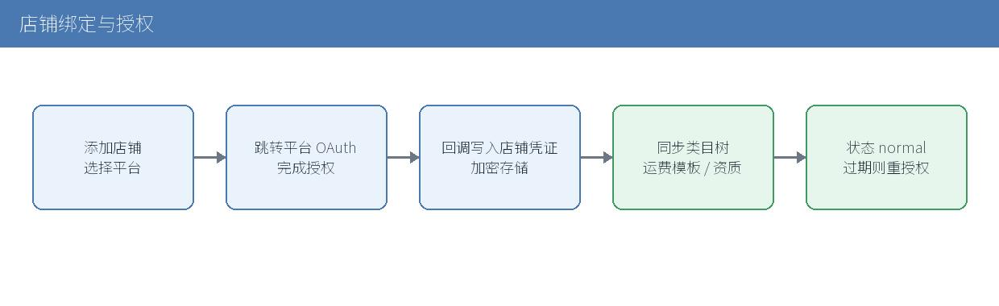  
图 8 店铺绑定与授权流程

21. 在「店铺与授权」添加店铺，选择平台。
22. 跳转平台授权页完成 OAuth，回调写入店铺凭证。
23. 同步目标平台类目树、运费模板与类目资质要求。
24. 店铺标记为 normal；授权过期标记为 expired 并提示重授权。

## **6.2 采集下载**

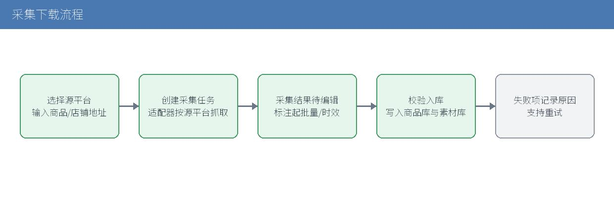  
图 9 采集下载流程

25. 选择源平台，输入商品链接（单商品）或店铺地址（整店）。
26. 创建 collect 任务，适配器按源平台拉取商品与素材。
27. 结果进入「采集结果」待编辑列表，标注起批量、发货时效等关键字段。
28. 校验通过的商品写入商品库与素材库；失败项记录原因并支持重试。
29. 选择素材与目标平台规格。
30. 执行处理器：抠图、白底、背景替换、去重（裁剪/调色/加边框）、尺寸比例、文案图。
31. 生成新素材（保留原素材），回写商品关联。
32. 去水印处理器标注仅适用于用户拥有版权的素材。
33. 选择商品，组装参考图（主图与 SKU 图）。
34. 选择生成类型：主图、场景图、详情页、模特图、带货视频。
35. 调用生成引擎（BYOK），经参考图机制保持商品主体一致。
36. 结果写入素材库并关联商品。

## **6.3 图片工坊**

## **6.4 AI 素材生成**

## **6.5 一键铺货（对标聚水潭 / 妙手）**

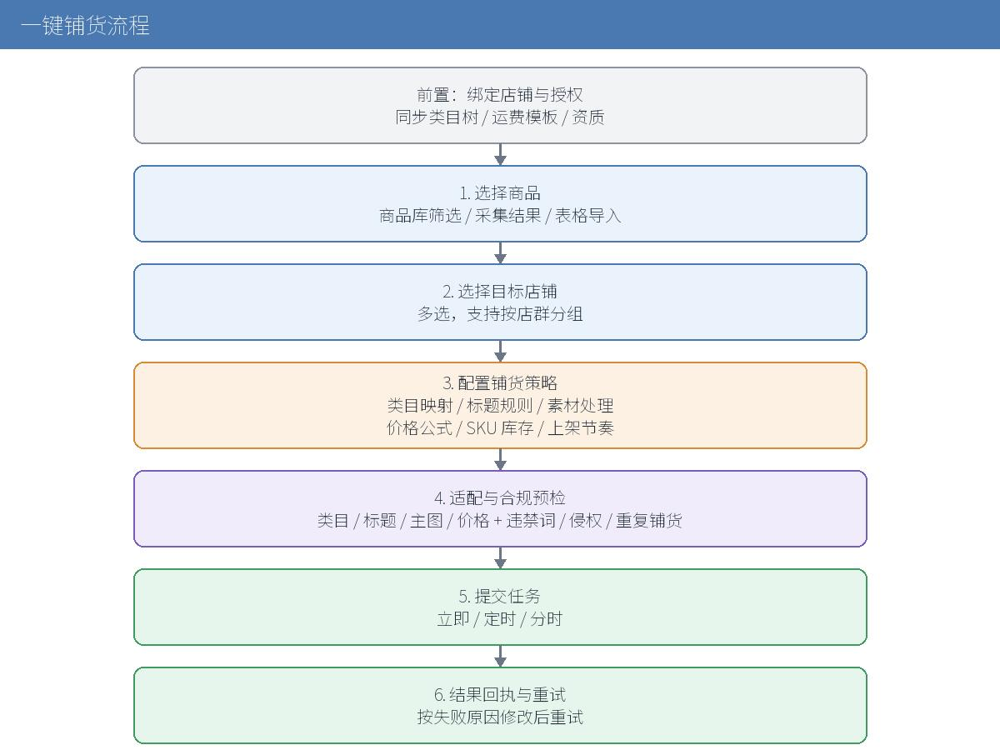  
图 10 一键铺货流程

前置：目标店铺已授权，类目树与资质已同步。

37. 选择商品：从商品库筛选、采集结果或表格导入。
38. 选择目标店铺：可多选，支持按店群分组批量选择。
39. 配置铺货策略：

- 类目映射：自动匹配目标类目树，人工确认。
- 标题规则：B 端词转 C 端场景词，前后缀与关键词库。
- 素材处理：去重、尺寸、主图规格。
- 价格公式：供货价 + 快递 + 平台佣金 + 预期利润 → 建议售价。
- SKU 与库存映射：规格对应、库存规则、预售。
- 上架节奏：每日条数、分时上架。

40. 适配与合规预检：类目、标题、主图、价格四维风险点，叠加违禁词、侵权、重复铺货检测。
41. 提交任务：立即或定时，进入任务中心。
42. 结果回执与重试：记录每个商品在目标店铺的结果；失败按原因提示修改后重试。

## **6.6 批量改价**

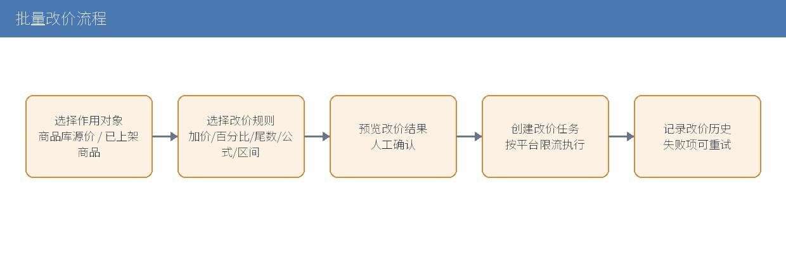  
图 11 批量改价流程

43. 选择作用对象：商品库源价或指定店铺已上架商品。
44. 选择/编辑改价规则：固定加价、百分比、尾数规则、公式、区间夹取。
45. 预览改价结果，确认后创建 priceAdjust 任务。
46. 走目标平台改价接口，按限流执行，记录改价历史。

## **6.7 批量上下架**

选择商品与目标店铺，批量提交上架/下架任务，记录结果。

## **6.8 定时与分时上架**

47. 定时：任务在指定时间执行（mode=at）。
48. 分时：按 Pacing 在时间窗内分批上架，避免集中发布（mode=recurring + window）。

## **6.9 店群聚合**

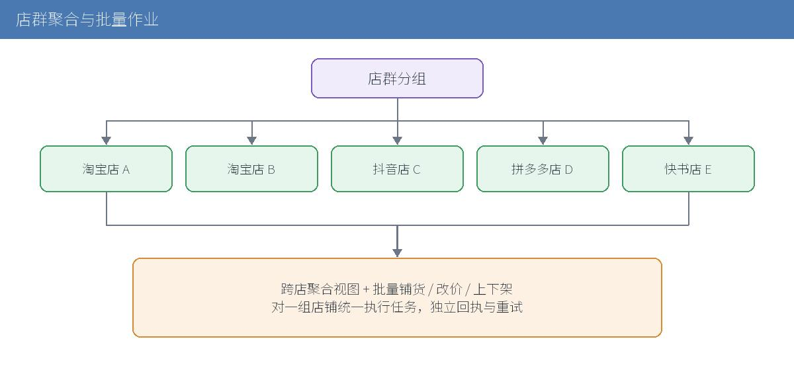  
图 12 店群聚合与批量作业

49. 把店铺分组为店群。
50. 提供跨店商品与任务聚合视图。
51. 对一组店铺批量执行铺货、改价、上下架。

## **6.10 合规检测**

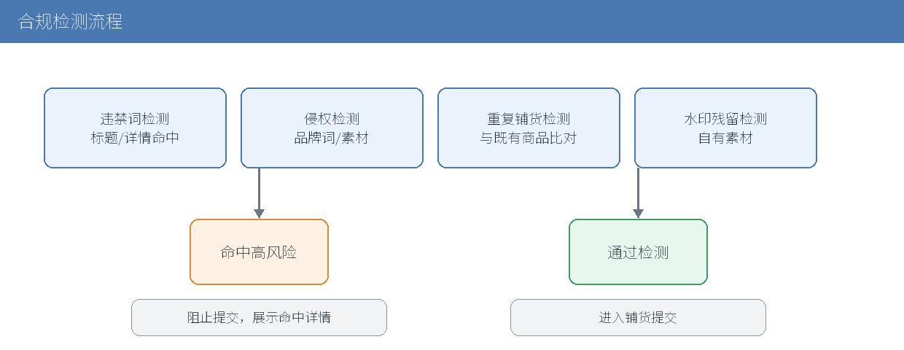  
图 13 合规检测流程

52. 违禁词检测：标题与详情命中词。
53. 侵权检测：品牌词与疑似侵权素材提示。
54. 重复铺货检测：与目标店铺既有商品比对。
55. 水印残留检测。
56. 命中高风险项阻止进入上架提交，并展示命中详情。

# **7. 任务与调度系统**

## **7.1 任务类型与状态机**

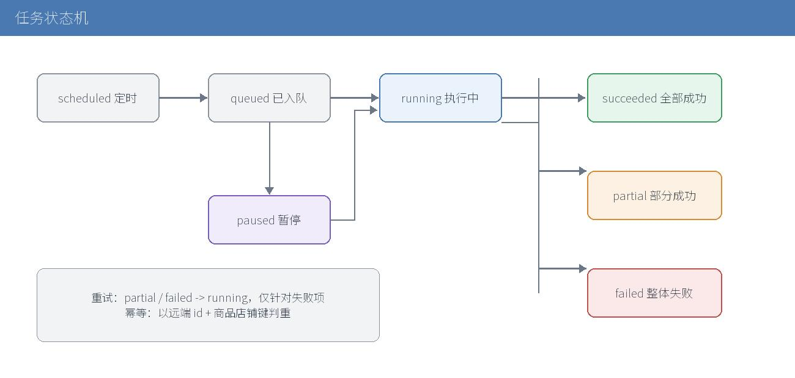  
图 14 任务状态机

- scheduled：定时任务待触发。
- queued：已入队。
- running：执行中。
- paused：人工暂停。
- succeeded：全部成功。
- partial：部分成功（存在失败项，可重试）。
- failed：整体失败。

## **7.2 任务模型**

见 5.9。任务项粒度到「商品 × 店铺」，便于多店批量的独立回执与重试。

## **7.3 队列与并发**

57. 服务端任务队列 + Worker。
58. 并发按平台限流配置，避免触发平台风控配额。
59. 同商品同店铺的重复任务做幂等去重。
60. 定时任务由调度器在指定时间入队。
61. 分时上架按 Pacing 在时间窗内分批入队，控制每分钟提交量。
62. 网络类错误自动退避重试；业务类错误不自动重试，等待人工修正。
63. 重试仅针对失败项，不重复已成功项。
64. 以远端 id 与商品店铺键做幂等判断。

## **7.4 调度**

## **7.5 失败重试与幂等**

## **7.6 任务中心 UI**

列表展示任务类型、范围、进度、成功/失败数；详情展示失败项原因与重试入口；支持暂停与取消。

# **8. 接口设计**

前缀：/dian/api/ecom/

<table><tr><td>
<strong>接口</strong>
</td><td>
<strong>方法</strong>
</td><td>
<strong>说明</strong>
</td></tr><tr><td>
/collect
</td><td>
POST
</td><td>
提交采集任务
</td></tr><tr><td>
/collect/{taskId}
</td><td>
GET
</td><td>
采集进度
</td></tr><tr><td>
/products
</td><td>
GET
</td><td>
商品列表（筛选/分页）
</td></tr><tr><td>
/products/{id}
</td><td>
PATCH
</td><td>
编辑商品
</td></tr><tr><td>
/products/batch
</td><td>
POST
</td><td>
批量编辑
</td></tr><tr><td>
/assets/process
</td><td>
POST
</td><td>
图片工坊批处理
</td></tr><tr><td>
/generate
</td><td>
POST
</td><td>
触发 AI 生成
</td></tr><tr><td>
/publish/precheck
</td><td>
POST
</td><td>
铺货预检（类目/标题/主图/价格/合规）
</td></tr><tr><td>
/publish
</td><td>
POST
</td><td>
提交铺货任务
</td></tr><tr><td>
/price/adjust
</td><td>
POST
</td><td>
提交批量改价任务
</td></tr><tr><td>
/listing/batch
</td><td>
POST
</td><td>
批量上下架
</td></tr><tr><td>
/compliance/check
</td><td>
POST
</td><td>
合规检测
</td></tr><tr><td>
/shops
</td><td>
GET/POST
</td><td>
店铺列表与添加
</td></tr><tr><td>
/shops/{id}
</td><td>
DELETE
</td><td>
移除店铺
</td></tr><tr><td>
/shops/auth
</td><td>
POST
</td><td>
发起/回调授权
</td></tr><tr><td>
/shop-groups
</td><td>
GET/POST
</td><td>
店群分组
</td></tr><tr><td>
/tasks
</td><td>
GET
</td><td>
任务列表
</td></tr><tr><td>
/tasks/{id}
</td><td>
GET
</td><td>
任务详情
</td></tr><tr><td>
/tasks/{id}/retry
</td><td>
POST
</td><td>
失败项重试
</td></tr><tr><td>
/tasks/{id}/pause
</td><td>
POST
</td><td>
暂停
</td></tr></table>

请求与响应遵循既有约定：同源、JSON、错误返回 {error, code}。

示例（铺货预检响应）：

{

"verdict": "warn",

"items": [

{ "productId": "p1001", "dimension": "category", "level": "pass", "message": "类目匹配" },

{ "productId": "p1001", "dimension": "title", "level": "warn", "message": "标题含B端词：厂家直供" },

{ "productId": "p1002", "dimension": "price", "level": "pass", "message": "按公式生成售价 39.9" }

]

}

# **9. 前端设计**

## **9.1 目录结构**

src/drama/ecom/

├─ ecom.js            分区注册与导航

├─ ecom-css.js        样式

├─ ecom-home.js       首页

├─ ecom-collect.js    采集下载

├─ ecom-products.js   商品库与素材库

├─ ecom-image.js      图片工坊

├─ ecom-ai.js         AI 创作

├─ ecom-publish.js    搬家铺货（含一键铺货向导）

├─ ecom-compliance.js 合规检测

├─ ecom-shops.js      店铺与授权

└─ ecom-tasks.js      任务中心

## **9.2 视图与组件**

沿用小龙虾外壳与组件样式（按钮、卡片、面板、表格），保持视觉一致。一键铺货采用分步向导组件，步骤状态在本地维护，提交后由任务中心接管。

## **9.3 状态管理**

- 每个视图维护本地状态（筛选、选择、分页）。
- 任务与商品数据以服务端为准，前端做缓存与轮询刷新。
- 跨视图共享的选择集（商品/店铺）通过分区级 store 维护。
- 命名沿用 ecom- 前缀，避免与短剧样式冲突。
- 批量操作提供全选、反选、按条件选择。
- 长任务展示进度条与可取消入口。

## **9.4 样式与交互**

# **10. 安全与合规**

65. 平台对接以官方开放接口与店铺授权为前提，遵循各平台开放平台规则。
66. 店铺授权凭证仅存服务端，加密保存，不进入前端存储与代码仓库。
67. 去水印能力仅用于用户拥有版权的素材，界面明确标注适用前提。
68. 铺货前执行违禁词、侵权与重复铺货检测，高风险项阻止提交。
69. 采集数据携带来源与时间，便于追溯。
70. 逐平台确认类目准入、品牌授权与素材版权要求。

# **11. 非功能需求**

<table><tr><td>
<strong>维度</strong>
</td><td>
<strong>要求</strong>
</td></tr><tr><td>
性能
</td><td>
单批几百商品的铺货任务可稳定执行；列表分页加载
</td></tr><tr><td>
可用性
</td><td>
授权失效、限流、网络异常均有明确提示与恢复路径
</td></tr><tr><td>
可维护性
</td><td>
新增平台只加适配器；业务编排与平台差异解耦
</td></tr><tr><td>
可观测性
</td><td>
任务日志、失败原因、请求耗时可用于排查
</td></tr><tr><td>
数据一致性
</td><td>
任务项幂等；重复提交不重复上架
</td></tr></table>

# **12. 分期路线与第一期工作分解**

## **12.1 分期路线**

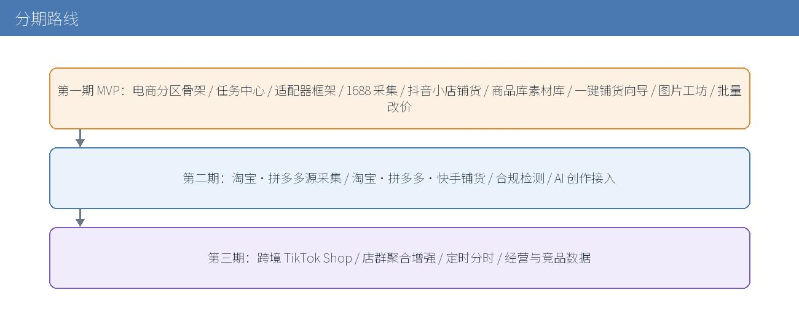  
图 15 分期路线

<table><tr><td>
<strong>阶段</strong>
</td><td>
<strong>内容</strong>
</td><td>
<strong>目标</strong>
</td></tr><tr><td>
第一期 MVP
</td><td>
电商分区骨架、任务中心、适配器框架、1688 采集、抖音小店铺货、商品库与素材库、一键铺货向导、图片工坊基础、批量改价
</td><td>
跑通「采集 → 铺货」单平台闭环
</td></tr><tr><td>
第二期
</td><td>
淘宝/拼多多源采集、淘宝/拼多多/快手指向铺货、合规检测、AI 创作接入
</td><td>
多平台覆盖与素材提质
</td></tr><tr><td>
第三期
</td><td>
跨境 TikTok Shop、店群聚合增强、定时与分时、经营与竞品数据
</td><td>
规模化运营
</td></tr></table>

## **12.2 第一期工作分解**

71. 电商分区骨架：视图注册、导航、样式、与短剧分区切换。
72. 后端基础：任务模型、队列、调度器、数据表（商品/素材/任务/店铺/规则）。
73. 适配器框架：注册表、凭证管理、限流、错误归一化、mock 契约。
74. 源适配器：1688 采集（单商品 + 整店）。
75. 目标适配器：抖音小店铺货（类目树、字段映射、发布、改价、上下架）。
76. 商品库与素材库：数据与界面。
77. 一键铺货向导：策略配置、预检、提交、结果。
78. 图片工坊：去重、尺寸、平台规格预设。
79. 批量改价：规则、预览、执行。
80. 测试：契约 mock、接口单测、jsdom 端到端。
81. 前端逻辑：node --test 覆盖视图逻辑与适配器消费契约。
82. 端到端：沿用 tests/drama-e2e.js 的 jsdom 方式，覆盖「采集 → 铺货」主链。
83. 后端：python3 -m unittest discover -s gate 覆盖接口、任务状态机与限流。
84. 适配器：以可注入 mock 验证统一契约，保证新增平台只加实现。
85. 合规：构造违禁词、重复铺货、缺字段样例，验证拦截与提示。

# **13. 测试策略**

# **14. 风险与对策**

<table><tr><td>
<strong>风险</strong>
</td><td>
<strong>对策</strong>
</td></tr><tr><td>
平台应用审核与权限点申请耗时
</td><td>
第一期先打通一个平台的完整闭环，验证框架
</td></tr><tr><td>
平台接口限流与配额
</td><td>
队列按平台限流，分时上架控制提交量
</td></tr><tr><td>
类目与资质要求差异大
</td><td>
同步类目树与资质，预检阶段拦截缺失项
</td></tr><tr><td>
授权过期导致批量失败
</td><td>
提前刷新 token，失败任务可整体重试
</td></tr><tr><td>
平台规则变化
</td><td>
适配器隔离差异，单平台升级不影响其他平台
</td></tr><tr><td>
素材版权风险
</td><td>
合规检测与来源标注，去水印限定自有素材
</td></tr></table>

# **15. 参考资料**

[^1]: (Website) - 甩手网 / 甩手掌柜系列功能说明  https://m.cifnews.com/tag/shuaishou

[^2]: (Website) - 癞蛤蟆电商工具箱功能说明  https://soft.china.com/software/1202313.html

[^3]: (Website) - 快手服务市场上货搬家类工具功能（牛牛搬家、妙手、智淘分销、聚水潭极速上货等）  https://fuwu.kwaixiaodian.com/new/list

[^4]: (Website) - 聚水潭 ERP 官网功能与多平台对接说明  https://web-jushuitan.com.cn/

[^5]: (Website) - 一键铺货操作流程（妙手：绑定授权、价格公式、采集、四维适配、发布重试）  http://www.dzwww.com/xinwen/jishixinwen/202609/t20260910\_18102849.htm

[^6]: (Filename) - src/drama/project.js  src/drama/project.js，资产与项目数据模型

[^7]: (Filename) - src/drama/config.js  src/drama/config.js，生成适配器配置

[^8]: (Filename) - src/drama/skill.js  src/drama/skill.js，技能流水线与执行引擎

[^9]: (Filename) - gate/server.py  gate/server.py，后端接口与资产通道