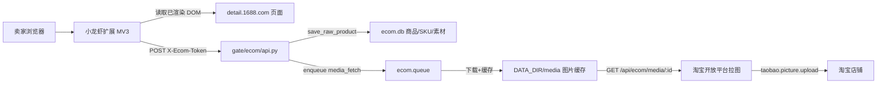
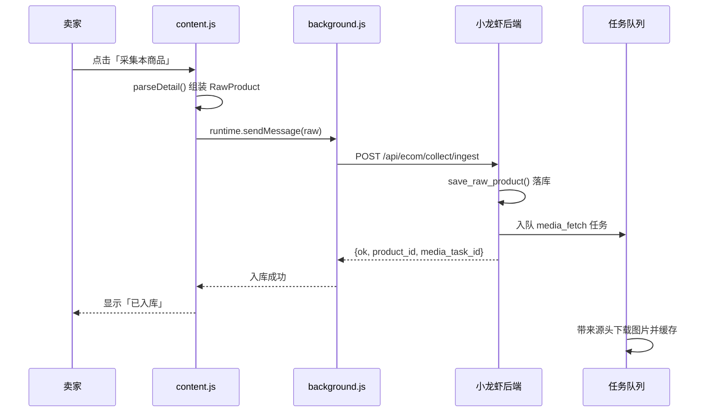

# Technical Design · 1688 采集浏览器插件

## Overview

本设计用浏览器扩展（Chrome / Edge，Manifest V3）替代已无法开通的 1688 官方开放平台采集链路。插件在**用户已登录的浏览器**中读取 1688 页面渲染后的商品数据，组装为统一的 `RawProduct`，通过一个带口令鉴权的 HTTP 接口提交到小龙虾后端；后端复用现有 `jobs.save_raw_product` 把商品落商品库 / SKU / 素材库，图片由后端带来源头代理转存，后续铺货完全复用现有「商品库 → 一键铺货向导 → 淘宝目标适配器」链路。

设计原则：

- **不在后端做 1688 请求**：采集发生在浏览器，后端只接收数据，因此不需要 1688 appkey，也不触碰反爬对抗。
- **最大化复用**：落库、幂等、素材去重、铺货、改价、上下架、合规检测全部沿用一期已有实现。
- **插件只读页面**：不代填密码、不模拟登录、不写入 1688。
- **口令鉴权**：插件用独立访问口令（`X-Ecom-Token`）识别 owner，避免依赖浏览器 Cookie。

### 依赖与既有事实（已核实）

- 后端路由：`gate/ecom/api.py` `handle(method, path, owner, query, body)` → `_dispatch`，按首段 `head` 分发（`collect` / `products` / `publish` / `shops` …）。
- 网关挂载：`gate/server.py:1447` `_handle_ecom`，路径 `/dian/api/ecom/*`，owner 来自会话 `_current()`（Cookie `xlx_sid`）。
- 落库：`jobs.save_raw_product(owner, platform, raw)` → `store.upsert_product` + `store.replace_skus` + `_save_media`，返回 `(product, sku_count, media_count)`。
- 幂等键：`store.upsert_product(owner, source_platform, source_id, data)` 已按 `(owner, platform, source_id)` upsert。
- 素材表 `media` 已含 `local_path` / `hash` / `source_url` / `source_type` 字段，正是转存所需。
- 任务队列：`queue.create_task(owner, kind, title, items, params)`；处理器注册表 `jobs._HANDLERS`（`jobs.install()`）。
- 数据目录：`DATA_DIR` 默认 `/home/admin/work/xiaolongxia-gate-data`。

## Architecture



采集时序：



## Components and Interfaces

### 1. 浏览器扩展（`extension/`）

Manifest V3，源码随仓库提交，可「加载已解压的扩展程序」安装，同时提供打包 zip。

| 文件 | 职责 |
|------|------|
| `manifest.json` | MV3 声明：`storage` / `tabs` / `scripting` / `activeTab`；`host_permissions` 覆盖 `https://*.1688.com/*`；`optional_host_permissions` 用于运行时申请小龙虾站点（站点地址可变）；`background.service_worker`、`action.default_popup`、内容脚本注入。 |
| `background.js` | Service Worker。唯一发起后端请求的地方（避免混合内容/CORS 问题）。持有配置，负责 `ingest` 提交、失败重试、批量任务编排、`chrome.storage.local` 读写。 |
| `content.js` | 内容脚本。检测页面类型（详情页 / 列表页），注入悬浮按钮与结果标记，调用 `parsers/1688.js` 读取 DOM，向 SW 发消息。 |
| `parsers/1688.js` | 采集解析层，全部选择器集中为 `SELECTORS` 常量。`parseDetail()` / `parseList()`。优先读页面内嵌 JSON（`window.__INIT_DATA__` / `iDetailData` / og 标签），DOM 选择器作回退。 |
| `popup.html` / `popup.js` | 配置站点地址与访问口令、显示连接状态、手动触发采集、查看最近入库结果。 |

关键行为：

- **站点识别**（Requirement 1）：仅当 `location.host` 命中 `*.1688.com` 时渲染入口；详情页显示「采集本商品」，列表页显示「采集本页商品」。
- **单商品采集**（Requirement 2）：`parseDetail()` 输出 `RawProduct`，SW 提交，成功显示「已入库」并提供跳转商品库链接。
- **批量采集**（Requirement 3）：`parseList()` 收集当前页所有 `a[href*="detail.1688.com/offer/"]` 的 offerId（去重）。批量采用**逐个详情页解析**：SW 用 `chrome.tabs.create({active:false})` 打开隐藏标签页 → `chrome.scripting.executeScript` 注入解析 → 提交 → 关闭，串行执行（每项间隔 `BATCH_INTERVAL_MS`，默认 800ms），逐条回写「已采集 / 失败」。
- **重试**（Requirement 9）：仅对网络类失败重试，最多 3 次，指数退避；业务错误（缺字段、鉴权失败）不重试。

### 2. 插件口令鉴权（新增 `gate/ecom/tokens.py` + `plugin` 路由）

Cookie 会话（`SameSite=Lax`）无法在扩展跨站请求中携带，因此新增独立口令，机制对齐既有 `blender_tokens.json` 先例。

- 存储文件 `DATA_DIR/ecom_tokens.json`，仅存 `sha256(token)`、owner、创建时间、可选备注；明文口令只在生成时返回一次。
- 接口（均需 Web 会话登录，只有本人能管理自己的口令）：

| 方法 | 路径 | 说明 |
|------|------|------|
| POST | `/api/ecom/plugin/token` | 生成本人插件口令，返回明文一次 |
| GET | `/api/ecom/plugin/token` | 返回口令是否存在、创建时间、掩码前缀（不回明文） |
| DELETE | `/api/ecom/plugin/token` | 撤销本人插件口令 |

- 校验：网关 `_handle_ecom`（`server.py:1447`）在 `_current()` 为空时，读取请求头 `X-Ecom-Token`，经 `tokens.owner_of()` 解析 owner；两者皆无则 401 `unauthorized`。

### 3. 采集入库接口（Requirement 4）

新增 `POST /api/ecom/collect/ingest`，在 `api.py` `_dispatch` 的 `head == "collect"` 分支增加 `rest == ["ingest"]`。

请求：

```json
{
  "platform": "1688",
  "items": [ { "source_id": "...", "title": "...", "price": 12.5, "images": [], "skus": [], "...": "..." } ]
}
```

处理逻辑：

1. 校验 `platform` 在白名单（默认 `1688`）、`items` 非空且不超过 `INGEST_MAX_ITEMS`（默认 200）。
2. 逐条校验：缺 `source_id` 或 `title` → 记为该条错误，**不落该条**，继续处理其余条（满足 4.5 且不整批回滚）。
3. 每条调用 `jobs.save_raw_product(owner, platform, raw)`。
4. 收集该商品的 `media`（`store.list_media(owner, product_id, kind="image")`），对尚无 `local_path` 的商品入队 `media_fetch` 任务（见下节）。
5. 返回：

```json
{
  "ok": true,
  "count": 10, "saved": 9, "failed": 1,
  "results": [ { "source_id": "...", "product_id": "p1", "skus": 4, "media": 6, "error": null } ],
  "errors": [ { "index": 7, "source_id": "", "error": "缺少 source_id" } ]
}
```

### 4. 图片代理转存（Requirement 5，新增 `gate/ecom/media.py`）

新任务类型 `media_fetch`，注册进 `jobs._HANDLERS`：

- `media_fetch_handler(task, item)` → 对 `item.payload.urls` 逐个执行 `media.cache_image(owner, product_id, url, platform)`。
- `cache_image` 细节：
  1. 校验 URL 为 `http/https`；**拒绝回环 / 私有网段 / 非 http(s) 目标**（SSRF 防护）。
  2. 带来源头请求：`Referer` 按平台映射（1688 → `https://detail.1688.com/`）、通用 `User-Agent`、`timeout`（默认 20s），响应体积上限 `MEDIA_MAX_BYTES`（默认 10MB）。
  3. 计算内容 `sha1`，落盘 `DATA_DIR/media/<owner>/<sha1>.<ext>`（原子写：先写 `.tmp` 再 `os.replace`）。
  4. 更新对应 `media` 行：`local_path`、`source_url` 保留、`meta_json.content_hash` 记录内容哈希；`media.hash` 维持 URL 哈希（沿用去重语义）。
- 图片对外地址：`GET /api/ecom/media/<media_id>`，**无需登录**（供淘宝服务器拉取），返回文件字节与正确 `Content-Type`；文件不存在返回 404。
  - 该路由在 `server.py` `do_GET` 的登录校验**之前**分发，绕过会话。
  - 对外绝对地址由 `ECOM_PUBLIC_BASE`（默认 `http://47.108.14.206`）拼出：`<base>/dian/api/ecom/media/<id>`。
- 转存完成后 `refresh_product_images(owner, product_id)`：按原顺序把商品 `main_image` / `images_json` 改写为本地可访问地址（主图优先）。
- 失败不回滚商品：记录失败 URL 到任务结果（满足 5.4）。
- 铺货预检新增一项：若商品仍有图片未转存完成，给出 warn 提示（不阻断）。

### 5. 与既有铺货链路衔接（Requirement 7）

不新增铺货逻辑。商品经 `save_raw_product` 后天然进入 `products` 表，因此：

- 出现在「商品库」列表（`/api/ecom/products`）。
- 可进入「一键铺货向导」，走 `target_taobao.py`（官方接口）。
- 支持现有批量改价、批量上下架、合规检测。

唯一新增触点：`ecom-collect.js` 采集视图增加「插件采集」面板，用于生成/复制/撤销插件口令、展示安装说明与扩展包下载链接。

## Data Models

### RawProduct（插件 → 后端）

| 字段 | 类型 | 必填 | 说明 |
|------|------|------|------|
| `source_id` | string | 是 | 1688 offerId（缺失或空则拒收该条） |
| `source_url` | string | 否 | 详情页 URL |
| `title` | string | 是 | 商品标题 |
| `subtitle` | string | 否 | 副标题 |
| `category` | string | 否 | 类目 |
| `price` | number | 否 | 价格（取区间最低价） |
| `stock` | number | 否 | 库存 |
| `main_image` | string | 否 | 主图 URL |
| `images` | string[] | 否 | 详情/轮播图 URL 列表 |
| `skus` | object[] | 否 | 见下 |
| `detail` | object | 否 | 详情（`{"html": "..."}`） |
| `attrs` | object | 否 | 属性键值 |

SKU 对象映射到 `skus` 表列：`spec`（如 `颜色:红;尺码:M`）、`source_sku_id`、`price`、`stock`、`image`、`attrs_json`。

### 插件口令记录（`ecom_tokens.json`）

```json
{ "<sha256>": { "owner": "admin", "prefix": "xlx_a1b2", "created_at": 1759... , "note": "" } }
```

### media 行变化

| 列 | 采集时 | 转存后 |
|----|--------|--------|
| `url` | 1688 原图 URL | 转存成功后改为本地对外地址 |
| `source_url` | 1688 原图 URL | 不变（留痕） |
| `local_path` | 空 | `DATA_DIR/media/<owner>/<sha1>.<ext>` |
| `hash` | URL 的 sha1 | 不变（去重键） |
| `meta_json.content_hash` | 无 | 图片内容 sha1 |

## Correctness Properties

1. **幂等**：同一 `(owner, platform, source_id)` 重复 ingest 不产生重复商品；`product.id` 保持不变。
2. **owner 隔离**：任何请求只能读写口令/会话对应 owner 的数据；跨 owner 不可见。
3. **入口即拒绝**：扩展在非 1688 页面不渲染任何入口。
4. **缺字段不落库**：缺 `source_id` 或 `title` 的条目绝不写入，且不影响同批其它条目。
5. **只读性**：扩展不向 1688 发送任何写操作，不读取/填写账号密码。
6. **媒体地址稳定**：转存成功后的图片地址在缓存文件存在期间始终可被外部 GET 到。
7. **SSRF 不可达**：`cache_image` 永远不请求内网 / 回环 / 非 http(s) 地址。
8. **无凭证依赖**：整条链路不读取 `ECOM_1688_APPKEY`，无 1688 凭证也能采集入库。

## Error Handling

| 场景 | 后端行为 | 插件行为 |
|------|----------|----------|
| 未带口令 / 口令失效 | 401 `unauthorized` | 提示「口令失效，请在扩展中重新配置」 |
| `items` 为空 / 超上限 | 400 `bad_request` | 不提交，提示错误 |
| 单条缺 `source_id` / `title` | 该条进 `errors`，其余照常 | 标记该条失败 |
| 图片下载失败 / 超时 / 超大 | 记入任务结果，商品保留 | 无感，商品仍入库 |
| 网络失败 | — | 同条重试至多 3 次，仍失败标记失败 |
| 媒体文件缺失 | `GET /media/:id` 404 | 预检 warn，提示重新采集 |

## Testing Strategy

沿用现有 `unittest`（`gate/test_ecom.py`）与前端 `node --test`。

- **后端单测（新增）**：
  - `plugin/token` 生成 / 校验 / 撤销；过期与错误口令返回 401。
  - `collect/ingest`：正常落库、幂等更新、缺字段部分成功、平台白名单、条数上限。
  - `media.cache_image`：SSRF 拒绝（`127.0.0.1` / `10.x` / `file://`）、体积上限、原子写、内容哈希。
  - `GET /media/:id`：命中返回字节与 Content-Type，缺失 404，免登录。
  - 媒体转存后商品 `main_image` / `images_json` 被改写为本地地址。
- **网关单测**：`_handle_ecom` 在无 Cookie 但带正确 `X-Ecom-Token` 时可解析 owner；错误口令 401。
- **前端单测**：采集视图「插件采集」面板渲染、口令生成/撤销调用、口令掩码显示。
- **手动验收**：真实 1688 详情页采集一个商品 → 商品库出现 → 图片转存完成 → 铺货预检通过。

## Deployment & Risks

- 迁移：无表结构新增（`media.local_path` / `ecom_tokens.json` 均可直接使用）；无需数据迁移。
- 配置：`ECOM_PUBLIC_BASE`（图片对外基址）、`MEDIA_DIR`（默认 `DATA_DIR/media`）、`INGEST_MAX_ITEMS`、`MEDIA_MAX_BYTES`、`BATCH_INTERVAL_MS`。
- 部署：后端改动随 `xiaolongxia-gate.service` 重启生效；扩展源码置于 `extension/`，另提供 zip 供用户下载加载。
- 风险：
  1. **混合内容**：线上为 HTTP（`http://47.108.14.206`），从 HTTPS 的 1688 页面发起请求。所有请求统一走 Service Worker，并在 `optional_host_permissions` 中申请该站点；需在真机验证 Chrome/Edge 允许。若被拦截，退路是给站点配可信任 HTTPS。
  2. **DOM 结构变动**：1688 前端改版会使选择器失效。以 `SELECTORS` 常量集中管理 + 优先读内嵌 JSON 降低影响。
  3. **批量节奏**：隐藏标签页串行 + 间隔，避免触发风控；不做整店翻页。
  4. **图片缓存体积**：长跑会占磁盘，后续可加清理策略（本期不做）。
  5. **口令泄漏**：口令明文仅显示一次、服务端只存哈希、可随时撤销。

## References

- 需求文档：`.monkeycode/specs/2026-09-29-ecom-collect-plugin/requirements.md`
- 一期设计：`.monkeycode/specs/2026-09-27-ecom-workbench/电商工作台-整体布局与设计.md`
- 现有实现：`gate/ecom/api.py`、`gate/ecom/jobs.py`、`gate/ecom/store.py`、`gate/ecom/queue.py`、`gate/server.py`
- 淘宝目标适配器：`gate/ecom/adapters/target_taobao.py`
