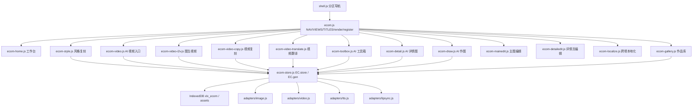

# 电商工作台能力补齐（风格复刻 / AI 视频 / AI 工具箱）

Feature Name: ecom-extra-modules
Updated: 2026-10-07

## Description

在现有电商工作台（`src/drama/ecom/*`，7 页）之上，按爱创 AI（51aic）的实际信息架构与字段原样补齐：**风格复刻**、**图生视频**、**视频复刻**、**视频翻译**、**AI 视频（入口页）**、**AI 工具箱**。视频三工具按 51aic 拆为三个独立页面，不再合并为单页多模式。复用现有 `EC.store`（IndexedDB 本地资产库）、`EC.gen`（图片/语言模型桥接）与 `XLX.drama.adapters.{video,tts,lipsync}` 生成底座；视频翻译新增 STT/OCR 后端接口与适配器（见 `stt-backend-plan.md`），生成模型 Key 沿用现状。

AI 工具箱采用混合实现：可在浏览器端完成的编辑（尺寸裁剪、修改尺寸、加水印、加文字、加边框、滤镜、素材、打马赛克、翻转旋转、色彩调节、涂鸦）走本地 Canvas；需要模型能力的（消除笔、AI 商品图、AI 模特、AI 扩图、尺码标注）走图片适配器。工具集对齐 51aic `/tools` 的 16 项。

## 已确认决策（2026-10-07）

1. **交付节奏**：风格复刻 / 图生视频 / 视频复刻 / 视频翻译 / AI 视频入口 / AI 工具箱共 6 个新入口，一次性交付。
2. **信息架构**：视频按 51aic 拆为「图生视频 / 视频复刻 / 视频翻译」三个独立页面，另设「AI 视频」入口页，字段逐项对齐，不做合并简化。
3. **AI 工具箱实现**：本地 Canvas 编辑 + 生成型走图片适配器（混合），共 16 项。
4. **生成模型 Key**：沿用现状，不改动。
5. **视频翻译**：完全对齐 51aic `/video/translate`。UI 字段对齐（原视频本地上传+链接上传 / 翻译模式 / 目标语言 / 时长策略 / 配音设置 / 原声处理 / 字幕设置），并覆盖「翻译语音、字幕及画面文字」。**新增 STT 后端接口**（默认火山录音文件识别大模型，鉴权 `X-Api-Key` 单 Key，留 `custom-stt` 入口）与 OCR 能力（画面文字），详见 `stt-backend-plan.md`。
6. **作品库回填**：图片作品「编辑」→ 回填 AI 工具箱，首版包含。

## Architecture



数据流：页面（视图）→ `EC.gen.*` 桥接 → 生成适配器 → 返回 URL → `EC.store.addFromUrl` 落 IndexedDB（kind 标注来源）→ 作品库统一读取。

## Components and Interfaces

### 1. 导航与骨架（`src/drama/ecom/ecom.js`）

`NAV` 由 7 项扩为 13 项，`VIEWS`/`TITLES` 同步。前 9 项按 51aic 顺序（作图 → 详情 → 风格 → 视频 → 工具箱），后 4 项为本工作台自有能力：

| # | id | label | icon |
|---|---|---|---|
| 1 | ecomHome | 工作台 | home |
| 2 | ecomDraw | AI 作图 | wand |
| 3 | ecomDetail | AI 详情图 | poster |
| 4 | ecomStyle | 风格复刻 | palette |
| 5 | ecomVideoI2V | 图生视频 | video |
| 6 | ecomVideoCopy | 视频复刻 | film |
| 7 | ecomVideoTranslate | 视频翻译 | globe |
| 8 | ecomVideoHome | AI 视频 | play |
| 9 | ecomToolbox | AI 工具箱 | spark |
| 10 | ecomMainEdit | 主图编辑 | crop |
| 11 | ecomDetailEdit | 详情页编辑 | layers |
| 12 | ecomLocalize | 跨境本地化 | translate |
| 13 | ecomGallery | 作品库 | grid |

- 新增 `TITLES`：ecomStyle `["风格复刻","参考设计图定风格 · 结合产品属性"]`、ecomVideoI2V `["图生视频","参考图 · AI 帮写脚本 · 商品讲解视频"]`、ecomVideoCopy `["视频复刻","爆款参考视频 · 同款带货视频"]`、ecomVideoTranslate `["视频翻译","语音/字幕/画面文字 · 多语言出海"]`、ecomVideoHome `["AI 视频","图生视频 · 视频复刻 · 视频翻译"]`、ecomToolbox `["AI 工具箱","16 项编辑 · 本地即改即存 + AI 生成"]`。
- 新增图标键（`XLX.ICONS`）：palette / video / film / globe / play / spark，需补入图标集，缺失时回退现有图标。
- 未注册渲染器时沿用现有 `placeholder()` 空态，施工期可先占位。
- `index.html` 同步：新增 6 个视图容器 `#ecomStyleView`、`#ecomVideoI2VView`、`#ecomVideoCopyView`、`#ecomVideoTranslateView`、`#ecomVideoHomeView`、`#ecomToolboxView`；新增 6 个 `<script>`（置于 `ecom-store.js` 之后、`shell.js` 之前）。
- 事件委托（`bindInteractions`）复用现有 `.tool-card`、`.chip`、`.switch`、`[data-mode-group]` 规则；新页面遵循既有类名约定。

### 2. 生成桥接扩展（`src/drama/ecom/ecom-store.js`）

现有 `EC.gen` 只有 `image`/`ask`。扩展为：

```
EC.gen = {
  image(opts)            // 现状：已配置走 adapters.image，未配置 pollinations 兜底
  video(opts, onProgress, signal)   // 新增：桥接 D.adapters.video.generate
  tts(opts)              // 新增：桥接 D.adapters.tts.synth
  lipsync(opts, onProgress, signal) // 新增：桥接 D.adapters.lipsync.generate
  configured(kind)       // 新增：kind ∈ image|video|tts|lipsync，委托 D.isConfigured
  ...
}
```

- `video`：调用 `D.adapters.video.generate(opts, onProgress, signal)`；未配置时抛 `NOT_CONFIGURED`（视频无免费兜底，与图片不同）。
- `tts`/`lipsync`：同理桥接，未配置抛 `NOT_CONFIGURED`。
- 产物落库统一用 `EC.store.addFromUrl(url, { kind, name, meta })`（内部 fetch→blob，失败降级存 URL，已有实现）。

### 3. AI 工具箱页（新建 `src/drama/ecom/ecom-toolbox.js`）

工具定义（16 项，对齐 51aic `/tools`）：

排列顺序对齐 51aic `/tools`（生成型在前，4 列网格）：

| id | label | kind | 关键参数 |
|---|---|---|---|
| eraser | 消除笔 | gen | mask 区域 + prompt |
| aiproduct | AI 商品图 | gen | 背景 prompt / 参考 |
| aimodel | AI 模特 | gen | 模特 prompt / 参考 |
| outpaint | AI 扩图 | gen | ratio / 方向 |
| crop | 尺寸裁剪 | canvas | x,y,w,h |
| resize | 修改尺寸 | canvas | w,h,fit |
| sizelabel | 尺码标注 | gen | 尺码文本 / 参考物 |
| watermark | 加水印 | canvas | text,opacity,angle,pos |
| text | 加文字 | canvas | text,x,y,size,color,effect |
| frame | 加边框 | canvas | width,color,radius |
| filter | 滤镜 | canvas | preset（黑白/复古/冷/暖/高对比） |
| material | 素材 | canvas | 素材图,x,y,w,h |
| mosaic | 打马赛克 | canvas | x,y,w,h,block |
| rotate | 翻转旋转 | canvas | rotate 90/180/270, flipH/V |
| adjust | 色彩调节 | canvas | 亮度/对比/饱和 |
| doodle | 涂鸦 | canvas | 笔迹点集,color,width |

11 项本地 Canvas，5 项生成型（消除笔/AI 商品图/AI 模特/AI 扩图/尺码标注）。

接口：

```
EC.toolkit = {
  TOOLS,                                   // 上述定义
  applyLocal(toolId, image, params) -> Promise<HTMLCanvasElement>,  // 纯 Canvas，可单测
  buildGenPrompt(toolId, params) -> string, // 生成型工具提示词模板
  render(el)                               // EC.register("ecomToolbox", ...)
}
```

- 页面结构（对齐 51aic `/tools` 截图）：
  1. 顶部品牌蓝横幅：「电商修图，一站搞定」标题 + 功能描述 + 「上传图片」「试试样片」两个按钮 + 右侧示意图（真实图）。
  2. 工具网格：4 列 16 卡，每卡 = 左侧标题/副标题 + 右侧真实缩略图（前后对比）+ 圆形「›」进入按钮；点击进入该工具的编辑态。
  3. 编辑态：左工具网格/切换 → 中部画布/预览 → 右参数面板（按工具动态渲染）→ 底部「保存到作品库」。
- 「上传图片」为真实上传入口；「试试样片」加载内置样张（真实图）直接进入编辑。
- 本地工具流程：载图（`EC.store.loadImage`）→ `applyLocal` → `EC.store.canvasToBlob` → `addDataUrl/addAsset`，`kind:"toolbox"`，`meta.tool`。
- 生成型工具流程：拼 prompt → `EC.gen.image` → `addFromUrl`，`kind:"toolbox"`。
- 输入图来源：本地上传（`EC.ui.pickFiles`）或作品库回填（`EC.store.get`）。

### 4. AI 视频（新建 4 个文件）

按 51aic 拆为入口页 + 三个独立工具页，各自注册独立 view：

#### 4.1 AI 视频入口（`ecom-video.js`）
- 注册 `ecomVideoHome`，渲染三张工具卡（图生视频 / 视频复刻 / 视频翻译），`data-go` 跳转对应 view。
- 复用现有 `.feature[data-go]` 事件委托，无独立生成逻辑。

#### 4.2 图生视频（`ecom-video-i2v.js`）
- 字段：参考图（JPG/JPEG/PNG/WEBP，≤3M，单张）、脚本（可「AI 帮写视频脚本」）、生成通道（灵动演绎/极速出片）、视频时长（5/10/15s）、视频比例（1:1/3:4/4:3/9:16/16:9）、视频分辨率（480P/720P）、视频语言。
- 提交：`EC.gen.video({ firstFrame, prompt, duration, ratio, resolution, channel, lang }, onProgress, signal)` → `addFromUrl`，`kind:"video"`，`meta.mode:"i2v"`。
- 「AI 帮写脚本」经 `EC.gen.ask` 生成；未配置语言模型时使用用户输入。

#### 4.3 视频复刻（`ecom-video-copy.js`）
- 字段：原视频（MP4/AVI/MOV/MKV/MPG，≤100MB）、产品图（JPG/JPEG/PNG/WEBP，≤10MB）、产品信息（选填，「AI 帮写」）、复刻要求（选填），以及生成通道 / 视频时长 / 视频比例 / 视频分辨率 / 视频语言。
- 提交：`EC.gen.video({ referenceVideo, referenceImage, prompt, duration, ratio, resolution, channel, lang }, onProgress, signal)` → `kind:"video"`，`meta.mode:"copy"`。
- 校验：原视频或产品图缺失即阻止提交。

#### 4.4 视频翻译（`ecom-video-translate.js`）
- 字段：原视频（MP4/WebM，≤100MB，本地上传 / 链接上传）、翻译模式（仅翻译语音 / 翻译语音+对口型）、目标语言（18 种）、视频时长策略（自然语速优先 / 与原视频一致）、配音设置（自动匹配音色）、原声处理（去除背景音乐）、字幕设置（需要/不需要新字幕、预设字幕样式、字号、行间距、字幕位置）。
- 管线：原视频公网化 → STT 识别（`EC.gen.stt`）→ LLM 翻译（`EC.gen.ask`）→ `EC.gen.tts({ text, voice })` 配音 → 字幕烧制 → 对口型模式下 `EC.gen.lipsync({ videoUrl, audioUrl })`；画面文字经 OCR → 翻译 → `video.edit` 重绘后合并。
- 落库 `kind:"video"`，`meta.mode:"translate"`、`meta.lang`、`meta.mode2`（voice/dub）、`meta.utterances`、`meta.subtitle`、`meta.textTranslate`。
- 设计决策：新增 STT 后端接口（默认火山录音文件识别大模型，`X-Api-Key` 单 Key，留 `custom-stt` 入口）与 OCR 能力，见 `stt-backend-plan.md`；缺 STT 配置时以「用户脚本 / LLM 补全脚本」兜底。

#### 4.5 公共约定
- 进度与取消：`onProgress(done,total)` 驱动进度条；`signal` 支持取消（`AbortController`）。
- 未配置视频模型时，提交前置校验 `EC.gen.configured("video")`，否则提示「请到设置配置视频模型」。TTS/对口型同理。

### 5. 风格复刻页（新建 `src/drama/ecom/ecom-style.js`）

- 上传风格参考设计图（≤16 张）+ 商品图（≤6 张），JPG/JPEG/PNG/WEBP（`kind:"upload"` 暂存）。
- 选项：生图要求（选填细节）、尺寸比例（10 种）、生成数量（1/2/3 组）、清晰度（1K/2K/4K）。
- 逐张生成：`EC.gen.image({ prompt: stylePrompt, refImages: [styleSrc, productSrc], ratio })`，`refImages` 顺序固定为 `[风格图, 商品图]`。
- 落库 `kind:"style"`，`meta.styleRef`、`meta.prompt`、`meta.provider`。
- 校验：缺参考设计图或产品图任一，阻止提交并提示（Requirement 5.4）。单类张数超上限时阻止追加并提示。

### 6. 工作台入口（`src/drama/ecom/ecom-home.js`）

在现有入口卡基础新增 6 张 `feature[data-go]` 卡，`data-go` 指向 `ecomStyle`/`ecomVideoI2V`/`ecomVideoCopy`/`ecomVideoTranslate`/`ecomVideoHome`/`ecomToolbox`。技能墙按需补对应条目。

### 7. 作品库扩展（`src/drama/ecom/ecom-gallery.js`）

- `KIND_CAT` 增加：`toolbox:"图片"`、`style:"图片"`、`video:"视频"`（现有 `video` 已映射视频）。
- 视频作品卡片增加时长/播放徽标；点击播放预览。
- 图片作品悬浮菜单增加「编辑」动作：跳转 `ecomToolbox` 并将该资产注入工具箱输入（Requirement 7.3）。
- 现有 `全部/图片/视频/详情页` 筛选即可覆盖新类型；如需要可加「工具箱产物」细分（可选，不进首版）。

## UI 视觉与交互约定（对齐 51aic）

依据 51aic `/tools` 真实页面（2026-10-07 截图校准）补充以下全局约定，适用于本次 6 个新页面/入口。

### A. 真实配图与界面美化

- 每个功能卡、工具卡、入口卡都配真实缩略图或「前后对比」样张，避免纯文字/线框的单一观感。
- 可放真实图的位置一律放真实图：页面头图/横幅、功能卡缩略图、工具箱 16 项前后对比、入口卡配图、空状态插图。
- 图片来源优先级：
  1. 51aic 真实页面素材（截图裁切 / 站内公开图片）。
  2. 公开图片搜索下载并落本地静态资源（`imgsearch_search`）。
  3. 沿用之前的方法本地生成样张（`image_generate_text_to_image`）。
- 落位：静态图放 `src/drama/ecom/assets/`（或复用现有静态目录），统一命名登记，页面用相对路径引用；生成型样张如需持久可入 `EC.store`。
- 视觉：横幅沿用品牌蓝（对齐 51aic `#3370ff` 系），卡片圆角/阴影/悬浮态对齐现有 `EC` 组件风格。

### B. 导航跳转（像 51aic 一样）

- 工作台入口卡、AI 视频入口页三张卡、工具箱卡、作品库「编辑」等所有可点元素，点击后按 51aic 行为跳转到对应视图（`ecom.js` 的 `go(view)`），不留无跳转的死按钮。
- 左侧导航与 51aic 同序，当前项高亮；返回用统一 back 行为。

### C. 滚动与翻页

- 每个视图（尤其工具箱、视频三页、作品库长列表）必须支持鼠标滚轮上下滚动；滚动容器设明确的 `overflow-y:auto` 与高度约束，避免被 flex/grid 撑爆导致锁死。
- 验收：内容超出一屏时，滚轮可正常上下滚动到底部；不得重现「滚不动 / 翻不了页」的历史问题。
- 移动端支持触摸滚动。

### D. 真实交互（非假交互）

- 所有输入、上传、下拉、chips、滑块、按钮、预览、进度、取消、结果落库与回填均为真实可用逻辑，连通 `EC.store` / `EC.gen` / `XLX.drama.adapters`，不以静态占位或无响应元素充数。
- 每个提交路径都要真实调用对应能力并在作品库可见；未配置能力的按钮在触发时给出明确配置引导。

## Data Models

沿用现有资产记录，无新表、无命名空间变更（IndexedDB `xlx_ecom` / store `assets`）：

```
Asset {
  id, createdAt,
  kind: "image" | "upload" | "edit" | "detail" | "localize"
       | "toolbox" | "style" | "video",   // 新增三类
  name,
  blob | url | dataUrl, mime,
  meta: {
    tool?,        // 工具箱：工具 id
    mode?,        // 视频：i2v | copy | translate
    mode2?,       // 视频翻译：voice（仅语音）| dub（语音+对口型）
    lang?,        // 视频：目标/视频语言
    styleRef?,    // 风格复刻：风格参考资产 id
    provider?, prompt?, ratio?
  }
}
```

## Correctness Properties

1. `NAV` 与 `VIEWS` 长度一致（13），且每个 view 在 `index.html` 有 `#<view>View` 容器。
2. 任一新增模块生成成功后，作品库必新增一条 `kind` 正确的记录。
3. `applyLocal` 输出画布尺寸：`resize` 后等于入参 `w×h`；`crop` 后等于裁剪框尺寸；`rotate` 交换宽高。
4. 风格复刻入参顺序恒为 `[风格图, 商品图]`。
5. 失败路径保留用户当前选择（工具/模式/上传素材）。
6. 未配置视频/语音模型时，提交动作给出明确提示，不产生静默兜底产物。
7. 视频选项取值受限于枚举：时长 ∈ {5,10,15}、比例 ∈ 5 种、分辨率 ∈ {480P,720P}、通道 ∈ 2 种。
8. 风格复刻参考设计图新增后不超过 16，商品图不超过 6；超限时拒绝追加。
9. AI 工具箱 `TOOLS` 长度为 16。
10. 视频三页面各自注册独立 view，且 `NAV` 中存在对应 id（ecomVideoI2V/ecomVideoCopy/ecomVideoTranslate/ecomVideoHome）。

## Error Handling

| 场景 | 处理策略 |
|---|---|
| 未配置图片模型 | 沿用 `EC.gen.image` 的 Pollinations 免费兜底 |
| 未配置视频/语音模型 | 抛 `NOT_CONFIGURED`，页面提示前往「设置」配置 |
| 未配置语言模型（视频翻译/文案） | 降级使用用户输入脚本原文，不翻译 |
| 上传文件非法/为空 | 校验 mime 与数量，toast 提示并阻止提交 |
| Canvas 跨域图片污染导出失败 | 复用 `EC.store.canvasToBlob` 的 `EXPORT_FAIL` 捕获，提示改用本地上传图 |
| 生成超时或适配器报错 | toast 失败信息，保留输入，允许重试 |
| 视频任务取消 | 通过 `AbortController` signal 中断，释放进度状态 |

## Test Strategy

**单元（`tests/ecom.test.js`，现 275 行）**
- 「注册：导航 7 项」改为 13 项；`VIEWS`/`TITLES` 覆盖 6 个新视图。
- AI 工具箱：16 张工具卡渲染；`applyLocal` 尺寸类断言（resize/crop/rotate）；生成型工具 `buildGenPrompt` 输出非空。
- AI 视频：三工具页各自渲染；未配置模型时提交得出 `NOT_CONFIGURED` 相关提示。
- 视频翻译：缺原视频 / 缺目标语言分别阻止提交。
- 风格复刻：缺参考设计图 / 缺产品图分别阻止提交；张数超限阻止追加。
- 作品库：`toolbox`/`style`/`video` 三类 `kind` 映射到「图片/视频」分类。

**端到端（`tests/drama-e2e.js`）**
- `DRAMA_FILES` 增加 `ecom/ecom-style.js`、`ecom/ecom-video.js`、`ecom/ecom-video-i2v.js`、`ecom/ecom-video-copy.js`、`ecom/ecom-video-translate.js`、`ecom/ecom-toolbox.js`。
- 注入 HTML 增加 6 个视图容器。
- `E.NAV.length`/`E.VIEWS.length` 断言 7 → 13；导航项数 7 → 13。
- 新增链路：六页渲染 + 关键交互（工具选择 / 上传校验 / 入口卡跳转）。

**网关（`gate/test_gate.py`）**
- 本设计不新增后端接口，网关不改，测试保持通过。若后续视频翻译需要 STT 后端，另立需求。

**静态与缓存**
- `index.html` 脚本引用同步；`sw.js` 缓存版本 `v88 → v89`。
- 提交基线：单元、端到端、网关三绿后再提交；前端静态覆盖生效，网关无改动无需重启服务。

## 与爱创 AI（51aic）对齐说明

依据 51aic 实际页面校准（2026-10-07），本设计按「有什么就有什么」在模块构成与字段级原样对齐 `/tools`、`/video`、`/video/copy`、`/video/translate`、`/style-copy`：

- **AI 工具箱**：对齐 `/tools` 的 16 项工具（尺寸裁剪、修改尺寸、消除笔、AI 商品图、AI 模特、AI 扩图、尺码标注、加水印、加文字、加边框、滤镜、素材、打马赛克、翻转旋转、色彩调节、涂鸦）。
- **图生视频**：对齐 `/video` 参考图输入与 AI 帮写脚本、双通道、时长/比例/分辨率、视频语言。
- **视频复刻**：对齐 `/video/copy` 原视频≤100MB、产品图≤10MB、产品信息/复刻要求、通道/时长/比例/分辨率/语言。
- **视频翻译**：对齐 `/video/translate` 原视频 MP4/WebM（本地上传/链接上传）、翻译模式、18 种目标语言、时长策略、配音/原声/字幕设置、画面文字翻译。
- **信息架构**：视频三工具拆为三个独立页面，另设「AI 视频」入口页；导航顺序与 51aic 一致，本工作台自有的「主图编辑 / 详情页编辑 / 跨境本地化」保留在其后。
- **风格复刻**：对齐 `/style-copy` 参考设计图≤16、产品图≤6、生图要求、比例 10 种、生成数量 1/2/3 组、清晰度 1K/2K/4K。
- **命名**：51aic「资产」对应本设计「作品库」，语义等价。
- 未覆盖 51aic 的既有能力：AI 详情图目标平台/语言等字段已在 `2026-10-06-ecom-image-factory` 规格内处理，本规格不重复。

## References

[^1]: (文件) - 需求文档 `requirements.md`（同目录）
[^2]: (ecom.js#L11) - 电商导航与视图注册 `src/drama/ecom/ecom.js`
[^3]: (ecom-store.js#L215) - 生图桥接与资产接口 `src/drama/ecom/ecom-store.js`
[^4]: (ecom-localize.js#L112) - 单页生成模板与落库范式 `src/drama/ecom/ecom-localize.js`
[^5]: (video.js#L73) - 视频适配器 generate(opts,onProgress,signal) `src/drama/adapters/video.js`
[^6]: (替换方案（评审稿）.md) - 电商图片工厂基线方案 `.monkeycode/specs/2026-10-06-ecom-image-factory/`
[^7]: (51aic /tools) - AI 工具箱 16 项工具 https://www.51aic.com/tools
[^8]: (51aic /video) - 图生视频字段与选项 https://www.51aic.com/video
[^9]: (51aic /video/copy) - 视频复刻字段与选项 https://www.51aic.com/video/copy
[^10]: (51aic /video/translate) - 视频翻译字段与选项 https://www.51aic.com/video/translate
[^11]: (51aic /style-copy) - 风格复刻字段与选项 https://www.51aic.com/style-copy
