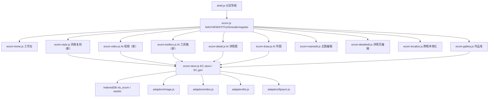

# 电商工作台能力补齐（AI 工具箱 / AI 视频 / 风格复刻）

Feature Name: ecom-extra-modules
Updated: 2026-10-07

## Description

在现有电商工作台（`src/drama/ecom/*`，7 页）之上新增三块对标爱创 AI（51aic）的能力缺口：**AI 工具箱**、**AI 视频**、**风格复刻**。三块一次性交付，复用现有 `EC.store`（IndexedDB 本地资产库）、`EC.gen`（图片/语言模型桥接）与 `XLX.drama.adapters.{video,tts,lipsync}` 生成底座，不新增后端接口，生成模型 Key 沿用现状。

AI 工具箱采用混合实现：可在浏览器端完成的编辑（裁剪、尺寸、水印、文字、边框、滤镜、马赛克、旋转翻转、色彩调节、涂鸦）走本地 Canvas；需要模型能力的（扩图、尺码标注、素材合成）走图片适配器。

## 已确认决策（2026-10-07）

1. **交付节奏**：三块（AI 工具箱 / AI 视频 / 风格复刻）一次性交付。
2. **AI 工具箱实现**：本地 Canvas 编辑 + 生成型走图片适配器（混合）。
3. **生成模型 Key**：沿用现状，不改动。
4. **视频翻译**：首版不新增 STT 后端，采用「用户提供原文脚本 / LLM 补全脚本 + TTS + lipsync」。
5. **工具箱范围**：13 项工具全部纳入首轮。
6. **作品库回填**：图片作品「编辑」→ 回填 AI 工具箱，首版包含。

## Architecture



数据流：页面（视图）→ `EC.gen.*` 桥接 → 生成适配器 → 返回 URL → `EC.store.addFromUrl` 落 IndexedDB（kind 标注来源）→ 作品库统一读取。

## Components and Interfaces

### 1. 导航与骨架（`src/drama/ecom/ecom.js`）

`NAV` 由 7 项扩为 10 项，`VIEWS`/`TITLES` 同步。导航顺序（创作 → 编辑 → 出海 → 归档）：

| # | id | label | icon |
|---|---|---|---|
| 1 | ecomHome | 工作台 | home |
| 2 | ecomDraw | AI 作图 | wand |
| 3 | ecomDetail | AI 详情图 | poster |
| 4 | ecomStyle | 风格复刻 | palette |
| 5 | ecomVideo | AI 视频 | video |
| 6 | ecomToolbox | AI 工具箱 | spark |
| 7 | ecomMainEdit | 主图编辑 | crop |
| 8 | ecomDetailEdit | 详情页编辑 | layers |
| 9 | ecomLocalize | 跨境本地化 | translate |
| 10 | ecomGallery | 作品库 | grid |

- 新增 `TITLES`：ecomStyle `["风格复刻","参考图定风格 · 套用到商品图"]`、ecomVideo `["AI 视频","图生视频 · 视频复刻 · 视频翻译"]`、ecomToolbox `["AI 工具箱","13 项基础编辑 · 本地即改即存"]`。
- 未注册渲染器时沿用现有 `placeholder()` 空态，施工期可先占位。
- `index.html` 同步：新增 3 个视图容器 `#ecomStyleView`、`#ecomVideoView`、`#ecomToolboxView`；新增 3 个 `<script>`（置于 `ecom-store.js` 之后、`shell.js` 之前）。
- 事件委托（`bindInteractions`）复用现有 `.tool-card`、`.chip`、`.switch`、`[data-mode-group]` 规则；新页面遵循既有类名约定。

### 2. 生成桥接扩展（`src/drama/ecom/ecom-store.js`）

现有 `EC.gen` 只有 `image`/`ask`。扩展为：

```
EC.gen = {
  image(opts)            // 现状：已配置走 adapters.image，未配置 pollinations 兜底
  video(opts, onProgress, signal)   // 新增：桥接 D.adapters.video.generate
  tts(opts)              // 新增：桥接 D.adapters.tts.synth
  lipsync(opts, onProgress, signal) // 新增：桥接 D.adapters.lipsync.generate
  configured(kind)       // 新增：kind ∈ image|video|tts|lipsync，委托 D.isConfigured
  ...
}
```

- `video`：调用 `D.adapters.video.generate(opts, onProgress, signal)`；未配置时抛 `NOT_CONFIGURED`（视频无免费兜底，与图片不同）。
- `tts`/`lipsync`：同理桥接，未配置抛 `NOT_CONFIGURED`。
- 产物落库统一用 `EC.store.addFromUrl(url, { kind, name, meta })`（内部 fetch→blob，失败降级存 URL，已有实现）。

### 3. AI 工具箱页（新建 `src/drama/ecom/ecom-toolbox.js`）

工具定义（13 项）：

| id | label | kind | 关键参数 |
|---|---|---|---|
| crop | 尺寸裁剪 | canvas | x,y,w,h |
| resize | 修改尺寸 | canvas | w,h,fit |
| text | 加文字 | canvas | text,x,y,size,color |
| watermark | 加水印 | canvas | text,opacity,angle,pos |
| frame | 加边框 | canvas | width,color,radius |
| filter | 滤镜 | canvas | preset（黑白/复古/冷/暖/高对比） |
| mosaic | 打马赛克 | canvas | x,y,w,h,block |
| rotate | 翻转旋转 | canvas | rotate 90/180/270, flipH/V |
| adjust | 色彩调节 | canvas | 亮度/对比/饱和 |
| doodle | 涂鸦 | canvas | 笔迹点集,color,width |
| outpaint | 扩图 | gen | ratio / 方向 |
| sizelabel | 尺码标注 | gen | 尺码文本 / 参考物 |
| merge | 素材合成 | gen | 素材图 + prompt |

接口：

```
EC.toolkit = {
  TOOLS,                                   // 上述定义
  applyLocal(toolId, image, params) -> Promise<HTMLCanvasElement>,  // 纯 Canvas，可单测
  buildGenPrompt(toolId, params) -> string, // 生成型工具提示词模板
  render(el)                               // EC.register("ecomToolbox", ...)
}
```

- 页面结构：左工具网格（13 卡，`register` 时由 `TOOLS` 生成）→ 中部画布/预览 → 右参数面板（按工具动态渲染）→ 底部「保存到作品库」。
- 本地工具流程：载图（`EC.store.loadImage`）→ `applyLocal` → `EC.store.canvasToBlob` → `addDataUrl/addAsset`，`kind:"toolbox"`，`meta.tool`。
- 生成型工具流程：拼 prompt → `EC.gen.image` → `addFromUrl`，`kind:"toolbox"`。
- 输入图来源：本地上传（`EC.ui.pickFiles`）或作品库回填（`EC.store.get`）。

### 4. AI 视频页（新建 `src/drama/ecom/ecom-video.js`）

模式定义：

```
MODES = [
  { id:"image2video", label:"图生视频" },
  { id:"replica",     label:"视频复刻" },
  { id:"translate",   label:"视频翻译" }
]
```

- **图生视频**：首帧图 + prompt + 比例 → `EC.gen.video({ firstFrame, prompt, ratio }, onProgress, signal)` → `addFromUrl`，`kind:"video"`，`meta.mode:"image2video"`。
- **视频复刻**：参考视频 URL + 商品图 + prompt → `EC.gen.video({ referenceVideo, referenceImage, prompt }, ...)` → `kind:"video"`，`meta.mode:"replica"`。
- **视频翻译**：视频 + 目标语言 + 原文脚本（可空）→ LLM 翻译脚本 → `EC.gen.tts({ text, voice })` → `EC.gen.lipsync({ videoUrl, audioUrl })` → `kind:"video"`，`meta.mode:"translate"`。
  - 设计决策：现有适配器无语音识别（STT），首版**不新增 STT 后端**，由用户提供脚本或由 LLM 依据商品信息补全脚本；未配置 LLM 时使用脚本原文。
- 进度与取消：`onProgress(done,total)` 驱动进度条；`signal` 支持取消（`AbortController`）。
- 未配置视频模型时，提交前置校验 `EC.gen.configured("video")`，否则提示「请到设置配置视频模型」。

### 5. 风格复刻页（新建 `src/drama/ecom/ecom-style.js`）

- 上传 1 张风格参考图 + 1..N 张商品图（`kind:"upload"` 暂存）。
- 逐张生成：`EC.gen.image({ prompt: stylePrompt, refImages: [styleSrc, productSrc], ratio })`，`refImages` 顺序固定为 `[风格图, 商品图]`。
- 落库 `kind:"style"`，`meta.styleRef`、`meta.prompt`、`meta.provider`。
- 校验：缺风格图或商品图任一，阻止提交并提示（Requirement 4）。

### 6. 工作台入口（`src/drama/ecom/ecom-home.js`）

在现有 4 大入口卡基础新增 3 张 `feature[data-go]` 卡，`data-go` 指向 `ecomToolbox`/`ecomVideo`/`ecomStyle`。技能墙按需补 3 条。

### 7. 作品库扩展（`src/drama/ecom/ecom-gallery.js`）

- `KIND_CAT` 增加：`toolbox:"图片"`、`style:"图片"`、`video:"视频"`（现有 `video` 已映射视频）。
- 视频作品卡片增加时长/播放徽标；点击播放预览。
- 图片作品悬浮菜单增加「编辑」动作：跳转 `ecomToolbox` 并将该资产注入工具箱输入（Requirement 5.3）。
- 现有 `全部/图片/视频/详情页` 筛选即可覆盖新类型；如需要可加「工具箱产物」细分（可选，不进首版）。

## Data Models

沿用现有资产记录，无新表、无命名空间变更（IndexedDB `xlx_ecom` / store `assets`）：

```
Asset {
  id, createdAt,
  kind: "image" | "upload" | "edit" | "detail" | "localize"
       | "toolbox" | "style" | "video",   // 新增三类
  name,
  blob | url | dataUrl, mime,
  meta: {
    tool?,        // 工具箱：工具 id
    mode?,        // 视频：image2video | replica | translate
    styleRef?,    // 风格复刻：风格参考资产 id
    provider?, prompt?, ratio?
  }
}
```

## Correctness Properties

1. `NAV` 与 `VIEWS` 长度一致（10），且每个 view 在 `index.html` 有 `#<view>View` 容器。
2. 任一新增模块生成成功后，作品库必新增一条 `kind` 正确的记录。
3. `applyLocal` 输出画布尺寸：`resize` 后等于入参 `w×h`；`crop` 后等于裁剪框尺寸；`rotate` 交换宽高。
4. 风格复刻入参顺序恒为 `[风格图, 商品图]`。
5. 失败路径保留用户当前选择（工具/模式/上传素材）。
6. 未配置视频/语音模型时，提交动作给出明确提示，不产生静默兜底产物。

## Error Handling

| 场景 | 处理策略 |
|---|---|
| 未配置图片模型 | 沿用 `EC.gen.image` 的 Pollinations 免费兜底 |
| 未配置视频/语音模型 | 抛 `NOT_CONFIGURED`，页面提示前往「设置」配置 |
| 未配置语言模型（视频翻译/文案） | 降级使用用户输入脚本原文，不翻译 |
| 上传文件非法/为空 | 校验 mime 与数量，toast 提示并阻止提交 |
| Canvas 跨域图片污染导出失败 | 复用 `EC.store.canvasToBlob` 的 `EXPORT_FAIL` 捕获，提示改用本地上传图 |
| 生成超时或适配器报错 | toast 失败信息，保留输入，允许重试 |
| 视频任务取消 | 通过 `AbortController` signal 中断，释放进度状态 |

## Test Strategy

**单元（`tests/ecom.test.js`，现 275 行）**
- 「注册：导航 7 项」改为 10 项；`VIEWS`/`TITLES` 覆盖三个新视图。
- AI 工具箱：13 张工具卡渲染；`applyLocal` 尺寸类断言（resize/crop/rotate）。
- AI 视频：三模式切换；未配置模型时提交得出 `NOT_CONFIGURED` 相关提示。
- 风格复刻：缺风格图 / 缺商品图分别阻止提交。
- 作品库：`toolbox`/`style`/`video` 三类 `kind` 映射到「图片/视频」分类。

**端到端（`tests/drama-e2e.js`）**
- `DRAMA_FILES` 增加 `ecom/ecom-style.js`、`ecom/ecom-video.js`、`ecom/ecom-toolbox.js`。
- 注入 HTML 增加 3 个视图容器。
- `E.NAV.length`/`E.VIEWS.length` 断言 7 → 10；导航项数 7 → 10。
- 新增链路：三页渲染 + 关键交互（工具选择/模式切换/上传校验）。

**网关（`gate/test_gate.py`）**
- 本设计不新增后端接口，网关不改，测试保持通过。若后续视频翻译需要 STT 后端，另立需求。

**静态与缓存**
- `index.html` 脚本引用同步；`sw.js` 缓存版本 `v88 → v89`。
- 提交基线：单元、端到端、网关三绿后再提交；前端静态覆盖生效，网关无改动无需重启服务。

## References

[^1]: (文件) - 需求文档 `requirements.md`（同目录）
[^2]: (ecom.js#L11) - 电商导航与视图注册 `src/drama/ecom/ecom.js`
[^3]: (ecom-store.js#L215) - 生图桥接与资产接口 `src/drama/ecom/ecom-store.js`
[^4]: (ecom-localize.js#L112) - 单页生成模板与落库范式 `src/drama/ecom/ecom-localize.js`
[^5]: (video.js#L73) - 视频适配器 generate(opts,onProgress,signal) `src/drama/adapters/video.js`
[^6]: (替换方案（评审稿）.md) - 电商图片工厂基线方案 `.monkeycode/specs/2026-10-06-ecom-image-factory/`
