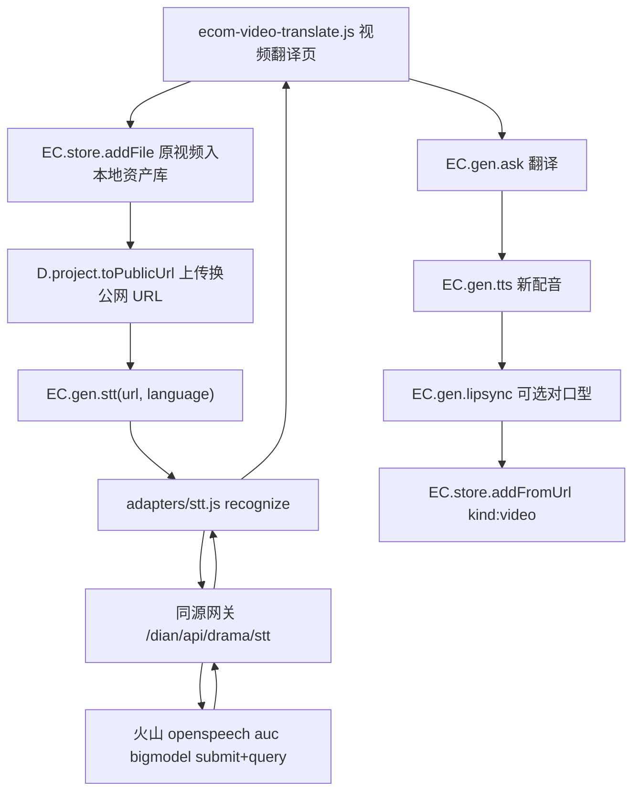

# 完整实现方案：STT 后端接口（视频翻译对齐 51aic）

Feature Name: ecom-extra-modules / stt-backend
状态: 完整方案（含确认决策与代码级落地），按 51aic 完全对齐，可开工
Updated: 2026-10-07

## 1. 目标

为「视频翻译」补齐语音识别（STT/ASR）能力，与 51aic `/video/translate` 的管线一致：

```
原视频 → 上传换公网 URL → STT 识别原文 → LLM 翻译译文 → TTS 生成配音
      → （对口型模式）lipsync 对齐嘴型 → 落作品库
```

本方案替换 `design.md` 第 4.4 节与决策第 5 条里「不新增 STT 后端、用脚本兜底」的旧决策；其余字段与布局保持原设计不变。

## 2. 已确认决策（2026-10-07）

1. **完全对齐 51aic**：`/video/translate` 有什么就做什么；它没有的就不加、不动。
2. STT 默认火山录音文件识别大模型；保留 `custom-stt` 入口供自行切换。
3. 鉴权按火山新版 API Key（`X-Api-Key` 单 Key）。
4. **字幕设置**按 51aic 原样纳入：是否需要新字幕、预设字幕样式（6 种）、字号（32–128）、行间距（1.0–2.0）、字幕位置（含详细设置），见第 9.1 节。
5. **画面文字翻译**：51aic 页面声明「翻译语音、字幕及画面文字」，纳入范围，见第 9.2 节。
6. 原视频支持「本地上传 + 链接上传」，见第 9.3 节。
7. 不做（51aic 没有）：SRT/脚本导出、纯字幕翻译模式、阿里/OpenAI 专用适配（仅留 `custom-stt` 空壳）。

## 2.1 技术选型基线

| 项 | 默认值 | 说明 |
|---|---|---|
| STT 服务商 | 火山引擎「录音文件识别大模型」 | submit + query 两步异步 |
| 鉴权 | 单 Key `X-Api-Key` | 与现有火山 TTS 一致，一个 Key 走通 |
| 资源 ID | `volc.bigasr.auc` | 可在设置里改 |
| 模型名 | `bigmodel` | 可在设置里改 |
| 备选通道 | `custom-stt` | 自定义接口 / OpenAI 兼容 `/audio/transcriptions` |
| 输入格式 | 直接吃 mp4 / mp3 / wav / m4a | 复用现有 `/dian/api/drama/asset` 公网化，无需本机提音轨 |
| 轮询 | 间隔 2s，总超时 90s | 参数化，便于测试注入 0 延迟 |

## 3. 端到端数据流



## 4. 后端实现（`gate/server.py`）

### 4.1 新增常量（放在 `VOLC_TTS_URL` 附近，`gate/server.py:894` 之后）

```python
VOLC_STT_SUBMIT_URL = "https://openspeech.bytedance.com/api/v3/auc/bigmodel/submit"
VOLC_STT_QUERY_URL = "https://openspeech.bytedance.com/api/v3/auc/bigmodel/query"
VOLC_STT_RESOURCE = "volc.bigasr.auc"
# 识别处理中/成功的状态码（火山 v3 响应头 X-Api-Status-Code）
VOLC_STT_DONE = "20000000"
VOLC_STT_RUNNING = ("20000001", "20000002")
```

需在文件头 import 区（`gate/server.py:1-27`）补 `import uuid`。

### 4.2 主函数 `drama_stt(...)`（完整草案）

```python
def _stt_audio_format(url):
    low = str(url or "").lower().split("?")[0]
    for ext in (".mp4", ".m4a", ".mp3", ".wav", ".aac", ".webm"):
        if low.endswith(ext):
            return ext.lstrip(".")
    return "mp4"


def _volc_stt_call(endpoint, api_key, resource, request_id, body):
    """调用火山识别 submit/query，返回 (status_code, message, payload)。"""
    req = urllib.request.Request(
        endpoint,
        data=json.dumps(body, ensure_ascii=False).encode("utf-8"),
        headers={
            "Content-Type": "application/json",
            "X-Api-Key": api_key,
            "X-Api-Resource-Id": resource,
            "X-Api-Request-Id": request_id,
            "X-Api-Sequence": "-1",
        },
        method="POST",
    )
    try:
        with urllib.request.urlopen(req, timeout=30) as res:
            raw = res.read().decode("utf-8", "replace")
            code = res.headers.get("X-Api-Status-Code", "")
            msg = res.headers.get("X-Api-Message", "")
    except urllib.error.HTTPError as exc:
        raw = exc.read().decode("utf-8", "replace")
        code = exc.headers.get("X-Api-Status-Code", "")
        msg = exc.headers.get("X-Api-Message", "")
    except urllib.error.URLError as exc:
        raise RuntimeError("连不上语音识别服务，请检查网络：" + str(exc.reason))
    try:
        payload = json.loads(raw) if raw else {}
    except json.JSONDecodeError:
        payload = {}
    return code, msg, payload


def _parse_stt(payload):
    result = payload.get("result") if isinstance(payload, dict) else None
    result = result if isinstance(result, dict) else {}
    utterances = []
    for u in (result.get("utterances") or []):
        if not isinstance(u, dict):
            continue
        utterances.append({
            "text": str(u.get("text") or ""),
            "start": int(u.get("start_time") or 0),
            "end": int(u.get("end_time") or 0),
        })
    return {
        "text": str(result.get("text") or "").strip(),
        "language": str(result.get("language") or ""),
        "utterances": utterances,
    }


def drama_stt(api_key, url, resource=None, language=None, model=None,
              timeout=90, interval=2.0):
    api_key = str(api_key or "").strip()
    resource = str(resource or "").strip() or VOLC_STT_RESOURCE
    url = str(url or "").strip()
    if not api_key:
        raise ValueError("缺少语音识别 API Key，请先到「设置 → 短剧服务」填好")
    if not url:
        raise ValueError("缺少需要识别的视频或音频地址")
    if not (url.startswith("http://") or url.startswith("https://")):
        raise ValueError("语音识别只接受公网素材地址")
    request_id = str(uuid.uuid4())
    req_cfg = {"model_name": str(model or "bigmodel").strip() or "bigmodel"}
    if language:
        req_cfg["language"] = str(language).strip()
    base_body = {
        "user": {"uid": "xlx-drama"},
        "audio": {"url": url, "format": _stt_audio_format(url)},
        "request": req_cfg,
    }
    code, msg, _ = _volc_stt_call(
        VOLC_STT_SUBMIT_URL, api_key, resource, request_id, base_body)
    if code and code != VOLC_STT_DONE and code not in VOLC_STT_RUNNING:
        raise RuntimeError("语音识别提交失败：" + (msg or ("code %s" % code)))
    deadline = time.time() + max(1.0, float(timeout))
    while time.time() < deadline:
        time.sleep(max(0.0, float(interval)))
        code, msg, payload = _volc_stt_call(
            VOLC_STT_QUERY_URL, api_key, resource, request_id, base_body)
        if code == VOLC_STT_DONE:
            return _parse_stt(payload)
        if code in VOLC_STT_RUNNING:
            continue
        if not code:
            continue
        raise RuntimeError("语音识别失败：" + (msg or ("code %s" % code)))
    raise RuntimeError("语音识别超时，请稍后重试")
```

说明：
- 查询请求复用同一 `request_id` 与同一 `base_body`。
- 结果时间戳按火山返回的毫秒整数透出；前端字幕按需换算。
- 轮询间隔与超时参数化，网关测试可传 `interval=0, timeout=1` 逼近即时。

### 4.3 处理器 `_handle_drama_stt`（镜像 `_handle_drama_tts`，`gate/server.py:1813`）

```python
def _handle_drama_stt(self):
    me = self._drama_me()
    if not me:
        return
    obj = self._drama_body()
    if not obj:
        self._json(400, {"ok": False, "error": "请求读不懂"})
        return
    try:
        data = drama_stt(
            obj.get("key"),
            obj.get("url"),
            obj.get("resource"),
            obj.get("language"),
            obj.get("model"),
        )
    except ValueError as exc:
        self._json(400, {"ok": False, "error": str(exc)})
        return
    except RuntimeError as exc:
        self._json(502, {"ok": False, "error": str(exc)})
        return
    except Exception:
        self._json(502, {"ok": False, "error": "语音识别失败，请检查 Key 与网络"})
        return
    self._json(200, {"ok": True, "text": data["text"],
                     "language": data["language"], "utterances": data["utterances"]})
```

### 4.4 路由注册（`gate/server.py:1564` 之后）

```python
if path == "/api/drama/stt":
    self._handle_drama_stt()
    return
```

## 5. 前端适配器（新建 `src/drama/adapters/stt.js`）

```javascript
/* 铜龙电商ai助手 · AI 短剧工作台 · 语音识别适配器 */
(function () {
  const D = XLX.drama;
  const U = D.adapterUtil;
  D.adapters = D.adapters || {};

  /* 火山录音文件识别要求 X-Api-Key 等头不在浏览器 CORS 白名单内，
     统一走同源网关 /dian/api/drama/stt 由服务端代发。 */
  const stt = {
    async recognize(opts) {
      const c = D.getAdapterConfig("stt");
      if (c.provider === "volc") return volc(c, opts);
      return custom(c, opts);
    }
  };

  async function volc(c, opts) {
    if (!c.key) throw D.err("NO_KEY", "火山语音识别需要 API Key，请到「设置 → 短剧服务」填写");
    if (!opts || !opts.url) throw D.err("NO_URL", "语音识别需要先上传视频或音频");
    const j = await U.httpJson("/dian/api/drama/stt", {
      method: "POST",
      headers: { "Content-Type": "application/json" },
      body: JSON.stringify({
        key: c.key,
        resource: c.cluster || "volc.bigasr.auc",
        model: c.model || "bigmodel",
        url: opts.url,
        language: opts.language || ""
      })
    });
    if (!j || j.ok === false) throw D.err("STT_FAIL", (j && j.error) || "语音识别失败");
    return { text: j.text || "", language: j.language || "", utterances: j.utterances || [], provider: c.provider };
  }

  async function custom(c, opts) {
    if (!c.base) throw D.err("NO_BASE", "尚未配置语音识别服务地址");
    const headers = { "Content-Type": "application/json" };
    if (c.key) headers["Authorization"] = "Bearer " + c.key;
    const j = await U.httpJson(c.base, {
      method: "POST",
      headers,
      body: JSON.stringify({ url: opts.url, language: opts.language || "", model: c.model })
    });
    const text = (j && (j.text || U.pick(j, "result.text"))) || "";
    if (!text) throw D.err("STT_FAIL", "语音识别返回异常：" + JSON.stringify(j).slice(0, 160));
    return { text: text, language: (j && j.language) || "", utterances: (j && j.utterances) || [], provider: c.provider };
  }

  D.adapters.stt = stt;
})();
```

## 6. 配置目录（`src/drama/config.js`）

在 `LIPSYNC_PROVIDERS`（`:161`）之后新增：

```javascript
/* ===== 语音识别适配器目录 ===== */
XLX.drama.STT_PROVIDERS = [
  {
    id: "volc",
    name: "火山引擎语音识别（录音文件大模型）",
    base: "https://openspeech.bytedance.com/api/v3/auc/bigmodel",
    cluster: "volc.bigasr.auc",
    model: "bigmodel",
    models: ["bigmodel"],
    keyHint: "火山语音 API Key（需先开通「录音文件识别大模型」）",
    keyLink: "https://console.volcengine.com/speech/new/setting/apikeys",
    color: "#3370ff"
  },
  {
    id: "custom-stt",
    name: "自定义语音识别接口",
    base: "",
    model: "",
    models: [],
    keyHint: "POST 返回 {text}，或 OpenAI 兼容 /audio/transcriptions",
    keyLink: "",
    color: "#10b981"
  }
];
```

并把 `adapterList`（`:222`）改为：

```javascript
XLX.drama.adapterList = function (kind) {
  return {
    image: XLX.drama.IMAGE_PROVIDERS,
    video: XLX.drama.VIDEO_PROVIDERS,
    tts: XLX.drama.TTS_PROVIDERS,
    lipsync: XLX.drama.LIPSYNC_PROVIDERS,
    stt: XLX.drama.STT_PROVIDERS
  }[kind] || [];
};
```

`getAdapterConfig` / `adapterDef` / `isConfigured` 通用实现直接复用；`cluster` 字段已由 `getAdapterConfig`（`:263`）读取。

## 7. 设置页（`src/settings.js`）

### 7.1 `DRAMA_KINDS`（`:167`）追加

```javascript
{ id: "stt", name: "语音识别（视频翻译）", desc: "把原视频里的人声转成文字，供翻译使用。推荐火山录音文件识别大模型。" }
```

### 7.2 `dramaKindBlock`（`:216`）

- 新增 `const isStt = meta.id === "stt";`。
- 在非 TTS 分支的 key/model 行后，为 volcano 补一个资源 ID 输入：

```javascript
+ (isStt && def && def.id === "volc"
   ? '<input class="inp" id="ds-' + meta.id + '-cluster" placeholder="资源 ID，如 volc.bigasr.auc" style="flex:2;min-width:180px" value="' + XLX.util.esc(cfg.cluster) + '">'
   : '')
```

### 7.3 `saveDramaServices`（`:262`）

已保存 `key/model/cluster/secret/appId`（`:271-280`），STT 无需额外改动即可持久化。

### 7.4 文案（`:255`）

把「这里的四类服务」改为「这里的五类服务」，描述里补一句语音识别。

## 8. 桥接层

### 8.1 `src/drama/ecom/ecom-store.js`（`EC.gen`，`:329`）

```javascript
function stt(opts) {
  if (!D.adapters || !D.adapters.stt || !D.adapters.stt.recognize) {
    return Promise.reject(err("NO_ADAPTER", "语音识别服务不可用"));
  }
  return Promise.resolve(D.adapters.stt.recognize(opts || {}));
}
function configured(kind) { try { return !!D.isConfigured(kind); } catch (e) { return false; } }
```

`EC.gen` 导出追加 `stt` 与 `configured`。

### 8.2 `src/pool.js`

- `syncDrama`（`:77`）数组加入 `"stt"`。
- `dramaRun`（`:67`）加入：

```javascript
if (kind === "stt") return A.recognize(opts);
```

## 9. 视频翻译页管线（`src/drama/ecom/ecom-video-translate.js`）

```javascript
async function runTranslate(input, opts, onProgress, signal) {
  // 1) 原视频公网化
  const asset = await EC.store.addFile(input.video, { kind: "upload", name: "原视频" });
  const publicUrl = await XLX.drama.project.toPublicUrl("asset:" + asset.id);
  // 2) 识别原文
  onProgress && onProgress("识别语音中", 0, 1);
  const stt = await EC.gen.stt({ url: publicUrl, language: opts.srcLang || "" });
  if (!stt.text) throw EC.ui.err("STT_EMPTY", "没有识别到人声，请确认视频包含清晰语音");
  // 3) 翻译译文（未配置 LLM 时保留原文）
  let dstText = stt.text;
  if (EC.gen.llmConfigured()) {
    dstText = await EC.gen.ask(
      "你是翻译。只输出译文，不要解释。",
      "把下面内容翻译成" + opts.targetLang + "：\n" + stt.text
    );
  }
  // 4) 生成配音
  onProgress && onProgress("生成配音中", 0, 1);
  const voice = await EC.gen.tts({ text: dstText, voice: opts.voice, speed: opts.speed || 1 });
  // 5) 对口型模式
  let videoUrl = publicUrl;
  if (opts.mode2 === "dub") {
    onProgress && onProgress("对齐嘴型中", 0, 1);
    const lp = await EC.gen.lipsync({ videoUrl: publicUrl, audioUrl: voice.url }, onProgress, signal);
    videoUrl = lp.url;
  }
  // 6) 落库
  return EC.store.addFromUrl(videoUrl, {
    kind: "video",
    name: "视频翻译·" + opts.targetLang,
    meta: { mode: "translate", mode2: opts.mode2, lang: opts.targetLang, srcText: stt.text, dstText: dstText }
  });
}
```

降级路径：`EC.gen.configured("stt") === false` 时，仍允许走「用户手填脚本 → LLM 翻译 → TTS」的旧兜底路径，并在 UI 明确提示。

### 9.1 字幕设置（对齐 51aic）

按 51aic 原样提供并在成片时烧入字幕：

| 字段 | 取值 |
|---|---|
| 是否需要新字幕 | 需要 / 不需要 |
| 预设字幕样式 | 6 种（对应 51aic 的 Text Style） |
| 字号 | 32–128 |
| 行间距 | 1.0–2.0（步进 0.1） |
| 字幕位置 | 可点开详细设置 |

实现：STT 返回的 `utterances` 带时间轴（`start`/`end`）→ 按时间轴把译文逐句生成字幕并烧入视频（浏览器端字幕轨或网关合成）。字幕样式落 `meta.subtitle`：

```
meta.subtitle = { enabled, style, fontSize, lineHeight, position }
```

### 9.2 画面文字翻译（对齐 51aic「画面文字」）

51aic 页面声明「自动翻译视频中的语音、字幕及画面文字」。落地管线：

1. 抽帧 → OCR 识别帧内文字（需新增 OCR/视觉能力）。
2. LLM 翻译文字。
3. 视频重绘：用现有视频适配器 `video.edit({ referenceVideo, prompt })`（seedance 视频编辑）按译文替换画面文字。
4. 与语音翻译结果合并输出。

依赖缺口：现有适配器无 OCR。新增方式（二选一，建议第一种，模式与本次 STT 一致）：

- 新增火山 OCR 适配器 `src/drama/adapters/ocr.js` + 网关端点 `/api/drama/ocr`（`drama_ocr()`，风格照抄 `drama_stt`）。
- 或复用多模态大模型（`XLX.llm` 视觉）做 OCR + 翻译。

落 `meta.textTranslate = { enabled: true, items: [{src, dst}] }`。

### 9.3 原视频上传方式（对齐 51aic）

上传原视频支持「本地上传 + 链接上传」两种入口：

- 本地上传：`EC.ui.pickFiles` → `EC.store.addFile` → 公网化。
- 链接上传：用户贴 URL → 直接作为 STT 输入（已是公网地址），跳过公网化。

## 10. 数据模型

沿用现有资产记录（IndexedDB `xlx_ecom` / store `assets`），补充视频翻译的 `meta` 字段：

```
Asset.meta (mode="translate") {
  mode2: "voice" | "dub",
  lang:  目标语言,
  srcText,      // STT 原文
  dstText,      // 译文
  utterances: [{ text, start, end }],                       // STT 时间轴
  subtitle:   { enabled, style, fontSize, lineHeight, position },
  textTranslate: { enabled, items: [{ src, dst }] }          // 画面文字翻译
}
```

## 11. 测试

### 11.1 网关（`gate/test_gate.py`，镜像 TTS 用例 `:660`）

| 用例 | 断言 |
|---|---|
| `test_drama_stt_submit_and_query_returns_text` | mock 两次 `urlopen`（submit 200 + query 20000000）；断言请求头 `x-api-key`/`x-api-resource-id`/`x-api-request-id`、body `audio.url`、返回 `text` |
| `test_drama_stt_surfaces_upstream_error` | query 返回错误码 → `RuntimeError` 含中文 |
| `test_drama_stt_requires_key_and_url` | 空 key / 空 url / 非 http url → `ValueError` |
| `test_drama_stt_timeout` | 持续返回处理中 → `RuntimeError("超时")`（`interval=0, timeout≈0.1`） |
| `test_drama_stt_endpoint_returns_text` | 未登录 401；登录后 200 `{ok:true,text}` |
| `test_drama_stt_endpoint_guards` | 缺 url → 400 |

### 11.2 单元（`tests/ecom.test.js`）

- `EC.gen.stt` 在无适配器时 reject `NO_ADAPTER`。
- `EC.gen.configured("stt")` 反映配置状态。
- 视频翻译缺原视频 / 缺目标语言仍阻止提交（保持既有断言）。
- STT 未配置时 UI 走兜底路径并提示。

### 11.3 端到端（`tests/drama-e2e.js`）

- `DRAMA_FILES` 增加 `adapters/stt.js`。
- 视频翻译页渲染 + 用桩 STT 返回文本，验证管线落到 `kind:"video"`、`meta.mode:"translate"`。

## 12. 缓存与部署

- `sw.js` 缓存版本递增（沿用现有版本号 +1）。
- 网关改动需重启 `xiaolongxia-gate.service`；前端静态覆盖即生效。
- 提交基线：三绿后提交。

```
# 单元
/usr/bin/node --test tests/*.test.js

# 端到端
NODE_PATH="$(npm root -g)" /usr/bin/node tests/drama-e2e.js

# 网关
cd gate && python3 -m unittest test_gate
```

## 13. 任务清单

- [x] 后端：`import uuid`、STT 常量、`drama_stt` + `_volc_stt_call` + `_parse_stt`（`gate/server.py`）
- [x] 后端：`_handle_drama_stt` + 路由 `/api/drama/stt`
- [x] 适配器：新建 `src/drama/adapters/stt.js`
- [x] 配置：`config.js` 新增 `STT_PROVIDERS` 并注册 `adapterList`
- [x] 设置页：`settings.js` `DRAMA_KINDS` + `dramaKindBlock` + 文案
- [x] 桥接：`ecom-store.js` `EC.gen.stt`/`configured`；`pool.js` 注册
- [x] 页面：`ecom-video-translate.js` 接入 STT 全链路 + 原视频「本地上传/链接上传」
- [x] 字幕：服务端 `drama_subtitle` + `/api/drama/subtitle`，ffmpeg drawtext 按 `utterances` 时间轴烧入（是否新字幕、样式、字号、行间距、位置）
- [x] 画面文字：新增 OCR 适配器 `adapters/ocr.js` + 网关 `/api/drama/ocr`（`drama_ocr()`）
- [x] 画面文字：多帧抽帧 OCR → 翻译 → `drama_subtitle` 以 drawtext overlay 重绘并烧入成片
- [x] 测试：网关 + 单元 + 端到端（69 / 228 / 388）
- [x] 缓存：`sw.js` 版本递增（v89 → v90）
- [x] 提交：三绿后推送（`bcb71e2` 至 `main`）

> 实现变动：第 9.2 节原设想的 `video.edit` 重绘改为服务端单源合成——新增 `/api/drama/subtitle`，用 ffmpeg `drawtext`（`fontfile` 指向 Noto CJK，`expansion=none` 以正确显示 `%`）同时烧入字幕与画面文字译文，避免二次转码与第三方视频编辑依赖。

## 14. 已定/落地约定（对齐 51aic，不再询问）

1. STT 服务商：默认火山；`custom-stt` 仅留空壳入口，不做阿里/OpenAI 专用适配。
2. 资源 ID 默认 `volc.bigasr.auc`，设置页可改。
3. 鉴权按新版 API Key（`X-Api-Key` 单 Key），不改请求头结构。
4. 需要分句时间轴：`utterances` 用于第 9.1 节字幕烧制。
5. 不做 SRT/脚本导出（51aic 无导出入口）。
6. 不做纯字幕翻译模式（51aic 两种模式都要改语音）。
7. 轮询默认间隔 2s、超时 90s；参数化便于测试。
8. `custom-stt` 默认协议：OpenAI 兼容 `/audio/transcriptions`。

## 15. References

- `gate/server.py:894` VOLC_TTS_URL 常量区；`:897` drama_tts；`:1564` 路由表；`:1813` `_handle_drama_tts`；`:1907` `_handle_drama_asset`
- `src/drama/adapters/tts.js`（STT 适配器仿写模板）
- `src/drama/config.js:161/222` LIPSYNC_PROVIDERS / adapterList
- `src/settings.js:167/216/262` DRAMA_KINDS / dramaKindBlock / saveDramaServices
- `src/drama/ecom/ecom-store.js:329` EC.gen；`src/pool.js:67/77`
- `src/drama/project.js:75` toPublicUrl
- `gate/test_gate.py:660` drama_tts 测试模板
- 需求 `requirements.md` R4；设计 `design.md` 第 4.4 节与决策 5
