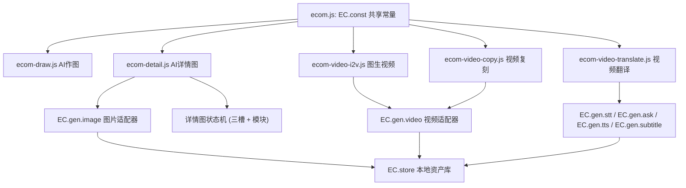

# 电商板块与爱创AI（51aic）对齐 · 缺口补齐

Feature Name: 2026-10-08-ecom-parity-gap-fill
Updated: 2026-10-08

## Description

本设计覆盖「铜龙电商ai助手 · 电商工作台」与爱创AI（51aic）全盘比对后识别出的全部缺口，一次性补齐并对齐字段取值。改动范围：

1. **AI 详情图**（`ecom-detail.js`）：产品素材由单槽改为三槽（主商品图 / 商品SKU图 / 商品细节图，各 ≤6）；新增「详情图模块」（AI规划 / 自选组合，自选 6 模块）；目标平台 7→21、语言 5→16、比例 4→10、张数 1→1–15。
2. **图生视频**（`ecom-video-i2v.js`）：视频语言 8→18；新增「灵感推荐」一键带入提示词；参考图上传区补限制提示。
3. **视频复刻**（`ecom-video-copy.js`）：新增「视频时长」5/10/15 与「视频比例」5；视频语言 8→18。
4. **视频翻译**（`ecom-video-translate.js`）：目标语言命名对齐 51aic 的 18 项。
5. **风格复刻**（`ecom-style.js`）：尺寸比例对齐 10 项（补 21:9、去 3:5）。
6. **共享常量**（`ecom.js`）：新增 `EC.const`，集中平台、语言、视频语言、详情图比例，供各页复用。

设计原则：字段与取值原样对齐 51aic；复用现有 `src/drama/adapters/*` 适配器、`EC.gen`、`EC.store`、`EC.ui`；保持 13 项导航与各页键名不变；不新增 51aic 未提供的能力。

## Architecture



常量层（`EC.const`）是纯数据，随 `ecom.js` 最先加载，供后续各页脚本直接引用，消除逐页重复定义。生成层与存储层沿用现有实现，本规格不改动其接口。

## Components and Interfaces

### 1. `src/drama/ecom/ecom.js` —— 共享常量

新增导出：

```js
EC.const = {
  PLATFORMS: [...21 项...],        // 智能匹配 … 快手
  LANGS: [...16 项...],            // 简体中文 … 巴西葡萄牙语
  DETAIL_RATIOS: [...10 项对象...],// {label:"1:1 正方形", value:"1:1"} …
  VIDEO_LANGS: [...18 项...]       // 简体中文 … 菲律宾语
};
```

接口约定：值为纯数组，页面只读；`DETAIL_RATIOS` 采用 `{label, value}` 以便菜单显示中文后缀、提交时取 `value`。

### 2. `src/drama/ecom/ecom-detail.js` —— AI 详情图（改动最大）

**状态模型**

```js
el.__gd = {
  slots: { main: [asset], sku: [asset], detail: [asset] }, // 各 ≤6
  moduleMode: "ai",                    // "ai" | "manual"
  modules: [ {name, desc, selected, count, maxCount} ], // 6 项，见数据模型
  uploads: []                          // 兼容旧字段，迁移为 slots.main
};
```

**接口与行为**

- `renderThumbs(el)`：遍历三个槽渲染缩略图，更新每个槽的 `data-upcount`。
- `addFiles(el, slotKey)`：按槽限量（≤6）写入 `slots[slotKey]`，`slotKey ∈ {main,sku,detail}`。
- `showHistory(el, slotKey)`：历史上传选择后写入指定槽。
- `renderModules(el)`：渲染「AI规划 / 自选组合」分段控件；自选模式下渲染 6 个模块卡片（勾选 + 张数增减，`count` 范围 `1..maxCount`），并在其下显示总张数「N 张」（已选模块 `count` 之和）。
- `buildPlan(el, req)`：`moduleMode==="manual"` 时以勾选模块及其张数展开画面列表；`==="ai"` 时沿用语言模型规划（`EC.gen.ask` + `extractJson`），生成张数取自 Requirement 3 的 1–15 选项。
- `generate(el, btn)`：主商品图必填校验 → 依据模块/规划得到画面列表 → 逐张调用 `EC.gen.image` → `EC.store.addFromUrl({kind:"detail"})`。
- `exportLong(el)`：保持现有长图导出逻辑不变。

**上传槽结构（对齐 51aic 文案）**

| 槽 key | 标题 | 副文案 | 必填 |
|---|---|---|---|
| `main` | 主商品图 | 上传主商品图和同一产品的多角度图片 | 是 |
| `sku` | 商品SKU图 | 不同颜色/款式 · 用于SKU展示 | 否 |
| `detail` | 商品细节图 | 材质/工艺/局部 · 用于细节展示 | 否 |

### 3. `src/drama/ecom/ecom-video-i2v.js` —— 图生视频

- `LANGS` 改为引用 `EC.const.VIDEO_LANGS`（18 项）。
- 新增 `TEMPLATES`（本地灵感示例：`{image, prompt, feature}`），在表单下方渲染「灵感推荐」列表；点击 `data-tpl` 将 `prompt` 写入 `[data-prompt]`。
- 参考图上传区补限制提示文案。

### 4. `src/drama/ecom/ecom-video-copy.js` —— 视频复刻

- 新增 `DURATIONS = ["5","10","15"]`、`RATIOS = ["1:1","3:4","4:3","9:16","16:9"]`。
- `LANGS` 引用 `EC.const.VIDEO_LANGS`。
- `run(el, btn)` 提交时读取 `data-group="duration"` 与 `data-group="ratio"` 并传入 `EC.gen.video`。

### 5. `src/drama/ecom/ecom-video-translate.js` —— 视频翻译

- `LANGS` / `LANG_EN` 替换为 51aic 的 18 项（简体中文…菲律宾语）及其语言代码。
- 其余（翻译模式、配音、原声、字幕、OCR）保持不变。

### 6. `src/drama/ecom/ecom-style.js` —— 风格复刻

- 比例 chip 列表改为 10 项：`1:1, 2:3, 3:2, 3:4, 4:3, 4:5, 5:4, 9:16, 16:9, 21:9`，移除 `3:5`。

### 7. `src/drama/ecom/ecom-draw.js` —— AI 作图 · 灵感推荐

- 新增 `DEMOS`（6 项，见数据模型），替换现有静态「示例作品」区块为可点击「灵感推荐」。
- 每个条目渲染：展示图 `image`、角标参考图 `referImage`、场景标签 `feature`、提示词 `prompt`。
- 点击行为对齐 51aic `handleDemoClick`：切换到 `agent` 模式 → `st.inl.prompt = demo.prompt` → 设置参考图 `st.files = [referImageAsset]` → `renderComposer(el)`。

## Data Models

### AI 作图灵感条目（对齐 51aic，6 项）

```js
[
  { feature:"场景图",   image:".../demos/1-1.png", referImage:".../demos/1-2.png", prompt:"为这款男士休闲板鞋设计一张高质感使用场景图。……" },
  { feature:"促销海报", image:".../demos/2-1.png", referImage:".../demos/2-2.png", prompt:"为这款奶咖色女士手提包设计一张促销海报。……" },
  { feature:"卖点图",   image:".../demos/3-1.png", referImage:".../demos/3-2.png", prompt:"为这款白银配色的无叶塔式风扇设计一张用于 Amazon 平台的英文卖点图。……" },
  { feature:"模特试穿", image:".../demos/4-1.png", referImage:".../demos/4-2.png", prompt:"为这款浅蓝色男士短袖T恤设计一张模特试穿图。……" },
  { feature:"商品主图", image:".../demos/5-1.png", referImage:".../demos/5-2.png", prompt:"基于我的商品生成1张电商主图，平台淘宝，语言要求中文" },
  { feature:"宣传海报", image:".../demos/6-1.png", referImage:".../demos/6-2.png", prompt:"为这款 LUMIÈRE 面霜设计一张高端护肤品商品宣传海报。……" }
]
```

`image`/`referImage` 为 51aic OSS 静态地址，直接引用（`https://oss.fzputi.com/aliProject/ai/make-image/demos/`）。

### 图生视频「发现灵感 一键同款」

51aic 该区块数据由服务端下发（SSR 为空），本站以本地示例条目实现同一交互：条目含参考图与脚本，点击后填入「视频脚本」并设置参考图。

### 详情图模块

```js
[
  { name: "主图",   desc: "展示商品首屏视觉图", selected: true,  count: 1, maxCount: 5 },
  { name: "卖点图", desc: "展示商品的核心卖点", selected: true,  count: 1, maxCount: 5 },
  { name: "细节图", desc: "放大材质与工艺",     selected: true,  count: 1, maxCount: 5 },
  { name: "场景图", desc: "呈现真实使用场景",   selected: true,  count: 1, maxCount: 5 },
  { name: "白底图", desc: "纯白色展示商品主体", selected: true,  count: 1, maxCount: 1 },
  { name: "尺寸图", desc: "展示商品尺寸图",     selected: false, count: 1, maxCount: 5 }
]
```

`count` 为模块当前张数（初始 1），`maxCount` 为上限；`selected` 决定是否参与生成，总张数为已选模块 `count` 之和（显示为「N 张」）。此模型对齐 51aic `main_image_set_params` 组件的 `moduleList`（主图/卖点图/细节图/场景图/白底图/尺寸图，白底图 `maxCount=1`、其余 `maxCount=5`，`totalImageCount` 为已选模块张数之和）。51aic 详情图「自选组合」的模块名未在可观测产物中渲染，本设计采用该组件同一套模块集合与计数语义，作为对 51aic 的忠实对齐。

### 共享常量

```js
PLATFORMS   = ["智能匹配","1688","阿里国际站","淘宝","天猫","拼多多","京东","抖音","亚马逊","TEMU","eBay","SHEIN","Shopee","Lazada","TikTok","Ozon","速卖通","独立站","美客多","小红书","快手"] // 21

LANGS       = ["简体中文","繁体中文","英语","日语","韩语","德语","法语","阿拉伯语","俄语","泰语","印尼语","越南语","马来语","西班牙语","葡萄牙语","巴西葡萄牙语"] // 16

DETAIL_RATIOS = [
  {label:"1:1 正方形",value:"1:1"},{label:"2:3 竖版",value:"2:3"},{label:"3:2 横版",value:"3:2"},
  {label:"3:4 竖版",value:"3:4"},{label:"4:3 横版",value:"4:3"},{label:"4:5 竖版",value:"4:5"},
  {label:"5:4 横版",value:"5:4"},{label:"9:16 手机竖版",value:"9:16"},{label:"16:9 宽屏",value:"16:9"},
  {label:"21:9 超宽屏",value:"21:9"}
] // 10

VIDEO_LANGS = ["简体中文","繁体中文","英语","泰语","俄语","越南语","马来语","葡萄牙语","西班牙语","日语","韩语","德语","法语","荷兰语","波兰语","土耳其语","印尼语","菲律宾语"] // 18

DETAIL_COUNTS = [1..15] // 生成张数
```

### 作品记录

沿用现有约定：`kind ∈ {image, upload, detail, video, style, toolbox}`；视频记录 `meta.mode ∈ {i2v, copy, translate}`。本规格不新增 kind。

## Correctness Properties

1. 三槽容量：任一槽的图片数量在任何操作后恒 `≤ 6`。
2. 主图必填：`slots.main.length === 0` 时生成动作被阻止。
3. 模块模式互斥：`moduleMode` 恒为 `"ai"` 或 `"manual"` 之一。
4. 自选模式非空：`moduleMode === "manual"` 且无勾选模块时生成被阻止。
5. 常量唯一来源：`PLATFORMS`/`LANGS`/`VIDEO_LANGS`/`DETAIL_RATIOS` 在各页引用同一 `EC.const`，无逐页副本。
6. 语言代码映射完备：视频翻译中每个 `VIDEO_LANGS` 项在 `LANG_EN` 均有对应代码。
7. 提交取值：比例与时长以用户当前选择提交，缺省时回退到该页默认值。

## Error Handling

| 场景 | 处理 |
|---|---|
| 图片超出槽上限 | 截断至剩余容量并 toast 提示「超出上限，仅添加前 N 张」 |
| 未上传主商品图 | 阻止生成并 toast「请先上传主商品图」 |
| 自选模式未勾选模块 | 阻止生成并 toast「至少选择一个详情图模块」 |
| 语言模型未配置 | 详情图回退到基于文本/上传图的本地规划；视频脚本帮写提示到设置配置 |
| 图片生成单张失败 | 该张位置显示「生成失败」，其余继续；保留已选素材与选项 |
| 视频生成失败 | 进度条置为失败并 toast；保留输入与选项 |
| 视频翻译无 STT | 显示手动填写口播脚本的回退输入框（现有能力） |

## Test Strategy

沿用现有三套测试，全部通过方可上线：

1. **前端单元测试** `tests/ecom.test.js`
   - 详情图：三槽上传与上限、槽计数渲染、主图必填阻止、模块模式切换、自选模块勾选、比例 10 项、张数 1–15。
   - 视频复刻：时长与比例选项存在且提交读取。
   - 图生视频：语言 18 项、灵感条目点击带入提示词。
   - 视频翻译：目标语言为 18 项且 `LANG_EN` 完备。
   - 风格复刻：比例为 10 项且不含 `3:5`、含 `21:9`。
   - 常量：`EC.const` 各数组长度与内容。
2. **端到端测试** `tests/drama-e2e.js`：详情图生成流程、视频页交互回归。
3. **网关测试** `gate/test_gate.py`：`python3 -m unittest test_gate`，本规格不改后端，作为回归基线。

命令：

```bash
cd /workspace/xiaolongxia-ai && NODE_PATH="$(npm root -g)" /usr/bin/node --test tests/*.test.js
NODE_PATH="$(npm root -g)" /usr/bin/node tests/drama-e2e.js
cd gate && python3 -m unittest test_gate
```

## References

[^1]: (51aic SSR) - AI 详情图页面选项与模块文案，见 `51aic-detail.pretty.html`（平台 21 / 语言 16 / 比例 10 / 张数 1–15）。
[^2]: (51aic bundle) - 详情图模块定义 `51aic-516bddf.js`（主图/卖点图/细节图/场景图/白底图/尺寸图）；平台数组与语言数组同文件。
[^3]: (51aic SSR) - 图生视频语言与灵感推荐、视频复刻配置、视频翻译语言，见 `51aic-video.html`、`51aic-videocopy.html`、`51aic-videotrans.html`。
[^4]: (Filename#L33-L37) - [AI 详情图现有选项定义](src/drama/ecom/ecom-detail.js)
[^5]: (Filename#L244-L297) - [AI 详情图注册与事件处理](src/drama/ecom/ecom-detail.js)
[^6]: (Filename#L8-L13) - [图生视频语言与常量](src/drama/ecom/ecom-video-i2v.js)
[^7]: (Filename#L8-L11) - [视频复刻常量](src/drama/ecom/ecom-video-copy.js)
[^8]: (Filename#L8-L13) - [视频翻译语言与代码](src/drama/ecom/ecom-video-translate.js)
[^9]: (Filename#L40-L51) - [风格复刻比例 chips](src/drama/ecom/ecom-style.js)
[^10]: (Filename#L25-L32) - [AI 作图平台/语言/比例常量（对齐 51aic）](src/drama/ecom/ecom-draw.js)
[^11]: (Filename#L12-L26) - [导航与视图注册](src/drama/ecom/ecom.js)
