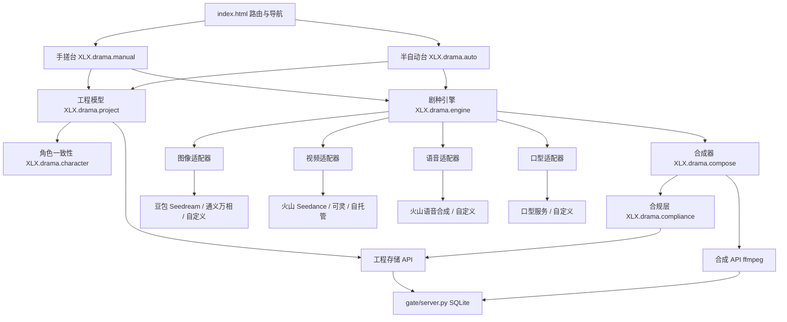
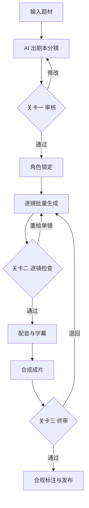

# 设计文档：AI 短剧工作台

功能名：ai-drama-workbench
更新日期：2026-09-16
文档类型：设计稿
对应需求：`requirements.md`

## 一、背景与目标

铜龙电商（小龙虾AI）当前是纯前端 PWA，入口为 `index.html`（4511 行），业务模块拆分在 `src/`（`config.js`、`util.js`、`settings.js`），后端店门为 `gate/server.py`。短剧相关旧实现已被提交 `e27660e` 移除，完整代码保留在备份文件 `index.html.bak.20260916_110335` 中，可回收复用以下能力：

| 旧模块 | 能力 | 复用方式 |
| --- | --- | --- |
| `XLX.image` | 生图/图生图，Pollinations、豆包 Seedream、通义万相、硅基流动、自定义 | 重构为图像适配器 |
| `XLX.comicdrama` | 剧本→分镜→逐镜生图→排版→配音合成 | 重构为漫剧引擎 |
| `XLX.video` | 浏览器 TTS、Canvas 字幕与 KenBurns、MediaRecorder 录 WebM | 拆出合成器，替换 TTS |
| `XLX.videogen` | 火山 Seedance、可灵 Kling、自托管异步任务 | 重构为视频适配器 |
| `selfhost-server` | FastAPI 同步式视频服务 | 作为本地适配器预留 |

本设计交付两个工作台与四个适配器，服务器无 GPU，全部推理走云端 API。

## 二、总体架构



### 分层职责

1. **视图层**：两套工作台 UI，负责编辑与关卡控制。
2. **领域层**：工程模型、角色一致性、剧种引擎、合成器，与具体厂商无关。
3. **适配层**：四个适配器封装外部服务，统一接口与错误码。
4. **合规层**：标注、授权、素材拦截、留档，横切导出与发布。
5. **持久层**：本地草稿（localStorage 加 IndexedDB 存大文件）与服务器工程存储。

前端模块按 `src/drama/` 目录拆分，`index.html` 通过 `<script src>` 按依赖顺序引入，遵循既有拆骨约定（每步 `node --check` 通过）。

```
src/drama/
├── config.js        适配器目录、画风预设、剧种预设、设置读写
├── adapters.js      适配器共享工具（XLX.drama.adapterUtil）
├── adapters/
│   ├── image.js     图像适配器
│   ├── video.js     视频适配器
│   ├── tts.js       语音适配器
│   └── lipsync.js   口型适配器
├── project.js       工程数据模型、IndexedDB 素材库、本地/服务器同步
├── character.js     角色卡与一致性提示词组装
├── engine.js        剧种引擎（漫剧/仿真人）
├── ui.js            共用部件与样式（状态徽章、分镜卡、进度）
├── compliance.js    AIGC 标注、肖像授权、素材拦截、留档
├── compose.js       分镜合成、字幕、音画、成片、素材包导出
├── manual.js        手搓台「逐镜工坊」
├── auto.js          半自动台「分镜流水线」
└── guide.js         工作台内教程与提示
```

以上模块均已实现（`node --check` 通过，浏览器环境加载烟测通过），`index.html` 新增「短剧手搓台」「短剧半自动台」两个导航入口并按依赖顺序引入脚本。

## 三、适配器接口

所有适配器实现同一形状：`create(task, ctx) -> {jobId}`、`poll(jobId) -> {status, result, error}`、`capabilities()`。同步式服务在 `create` 内直接返回完成态。

### 3.1 图像适配器

```js
XLX.drama.adapters.image = {
  id: "seedream",
  capabilities() { return { image2image: true, maxRefs: 3, ratios: ["1:1", "9:16", "16:9"] }; },
  async create({ prompt, negativePrompt, ratio, refImages, seed }) {},
  async poll(jobId) {}
};
```

内置实现：`seedream`（豆包）、`wanx`（通义万相）、`pollinations`（免费兜底）、`custom`（OpenAI 兼容）。

### 3.2 视频适配器

仿真人主用 Seedance，沿用旧 `XLX.videogen` 的异步任务协议（`POST /api/v3/contents/generations/tasks`、`GET /tasks/{id}`、结果 `content.video_url`）。

```js
XLX.drama.adapters.video = {
  id: "seedance",
  capabilities() { return { image2video: true, firstLastFrame: true, audio: true, ratios: ["9:16", "16:9"], durations: [5, 10] }; },
  async create({ prompt, firstFrame, lastFrame, ratio, resolution, duration, audio }) {},
  async poll(jobId) {}
};
```

内置实现：`seedance`、`kling`、`custom`（任务式或同步式，兼容 `selfhost-server` 协议）。

### 3.3 语音适配器

火山引擎语音合成，走其 HTTP 接口（`https://openspeech.bytedance.com/api/v1/tts`，Bearer 鉴权，请求体含 `app.appid/app.token/app.cluster` 与 `audio.voice_type`）。Key 存于用户本地设置，不经过服务端。

```js
XLX.drama.adapters.tts = {
  id: "volc",
  capabilities() { return { voices: [], speed: [0.5, 2.0], pitch: [-12, 12], formats: ["mp3", "wav"] }; },
  async synth({ text, voice, speed, pitch, format }) {} // 返回 { url, duration }
};
```

内置实现：`volc`、`custom`（HTTP 返回音频）。

### 3.4 口型适配器

```js
XLX.drama.adapters.lipsync = {
  id: "volc-koubo",
  capabilities() { return { videoInput: true, imageInput: true, maxDuration: 60 }; },
  async create({ videoUrl, imageUrl, audioUrl }) {},
  async poll(jobId) {}
};
```

内置实现：`volc-koubo`、`custom`。

适配器注册表在 `src/drama/config.js`，设置页复用 `XLX.settings` 的模型库交互新增短剧服务分组。

## 四、数据模型

服务器 SQLite 表（在 `gate/server.py` 内新增，沿用现有用户与房间；库文件位于 `DATA_DIR` 下，`ensure_drama()` 建表并启用 WAL）：

```
projects   (id, owner, title, genre, engine, status, created_at, updated_at)
characters (id, project_id, name, identity, appearance, ref_images_json)
shots      (id, project_id, seq, prompt, line, duration, motion, image_url, video_url, audio_url, lipsync_url, status)
assets     (id, project_id, shot_id, kind, url, local_path, meta_json)
consents   (id, owner, subject, scope, confirmed_at, ip_hash)
publishes  (id, project_id, owner, output_url, meta_json, marked_aigc, created_at)
usage      (id, owner, day, count, limit)
```

前端工程对象：

```js
{
  id, title, genre: "comic" | "realistic", engine,
  script: { logline, outline, scenes: [] },
  characters: [{ id, name, identity, appearance, refImages: [] }],
  shots: [{ id, seq, prompt, line, roleIds, duration, motion,
            imageUrl, videoUrl, audioUrl, lipsyncUrl, status, error }],
  style, subtitle, bgm, output: { ratio, resolution, fps },
  compliance: { aigcMarked, consentIds: [] },
  updatedAt
}
```

分镜状态机：`pending → generating → done | failed`。合成前置校验要求全部 `done`。

服务端接口（`gate/server.py`，前端经 `/dian` 前缀访问，按登录用户隔离）：

```
GET  /api/drama/projects            列出当前用户的工程
GET  /api/drama/projects/{id}       读取单个工程（含角色/分镜/素材）
GET  /api/drama/publishes           列出发布记录
GET  /api/drama/out/{name}          下载合成成片（mp4/webm，文件名白名单）
POST /api/drama/projects            新建/覆盖保存工程
POST /api/drama/projects/delete     删除工程
POST /api/drama/publishes           记录一次发布（含 AIGC 标注）
POST /api/drama/compose             提交合成任务（服务端 ffmpeg）
```

约束：单工程上限 `DRAMA_MAX_PROJECTS`，单请求体上限 `DRAMA_MAX_BYTES`，下载素材上限 `DRAMA_ASSET_MAX`，合成超时 `DRAMA_COMPOSE_TIMEOUT`；服务器无 ffmpeg 时返回 501，合成超时返回 504。输出目录 `ROOM_ROOT/<owner>/drama-out`。

## 五、关键流程

### 5.1 手搓台


每一步都是独立按钮，用户不点不执行。任一镜可反复重绘，改动只影响该镜。

### 5.2 半自动台



关卡是强制人工闸门，系统在关卡处停止并等待用户确认。

### 5.3 合成

1. 服务端 ffmpeg 为主路径：按分镜拼视频或图片加微动效，混入配音轨，烧入字幕，叠加 AIGC 角标，写入隐式元数据，输出 mp4。
2. 浏览器端为兜底路径：复用旧 `XLX.video.composeVideo` 的 Canvas 与 MediaRecorder 方案，输出 WebM。
3. 素材包导出：分镜片段、配音 mp3、字幕 srt、分镜表 csv、成片 mp4 打包为 zip。

### 5.4 角色一致性

角色卡组装提示词为「统一样式词 + 角色外观设定 + 该镜动作描述 + 参考图」，参考图随图像或视频适配器请求发送。角色参考图更新时标记受影响分镜，提供批量重绘。

## 六、合规设计

- **显式标注**：合成时在固定位置烧录「AI 生成」角标，位置与透明度写死在合成器，可由店主决定是否可关。
- **隐式标注**：mp4 写入 AIGC 元数据字段（`comment` 与自定义 atom），并生成一份标注记录。
- **肖像授权**：首次引入真人形象时弹出授权声明，勾选后写入 `consents` 表。
- **真人素材拦截**：上传入口调用浏览器端人脸检测，命中则阻止用于人脸替换，并提示交由店主审核。
- **留档**：`publishes` 表保存生成参数、适配器与模型、标注状态、授权引用。

## 七、正确性约束

1. 任一镜的生成状态与其资源 URL 一致：`status=done` 当且仅当对应 `imageUrl` 或 `videoUrl` 非空。
2. 合成前置条件：全部分镜 `done` 且配音齐全，否则合成失败并返回缺失列表。
3. 工程隔离：查询与写入始终带 `owner` 过滤，朋友的请求无法命中他人工程。
4. Key 隔离：服务端任何表与日志都不出现 Key，Key 仅存于用户本地。
5. 角色一致性：同一工程内角色卡名称唯一，分镜引用的角色必须存在于角色卡集合。
6. 合规不变式：任何导出产物都带显式与隐式标注；带真人形象的作品必须有对应授权记录。

## 八、错误处理

| 场景 | 处理 |
| --- | --- |
| 适配器未配置 Key | 提示前往设置，工作台禁用对应生成按钮 |
| 生成任务失败 | 该镜标记 `failed`，保留参数，支持单镜重试 |
| 视频生成超时 | 展示可取消的等待态，超时后标记失败并保留参数 |
| 轮询接口限流 | 指数退避，上限内持续轮询 |
| 合成失败 | 返回失败镜列表与 ffmpeg 错误摘要 |
| 网络中断 | 本地草稿继续可编辑，恢复后同步并提示冲突 |
| 人脸素材命中 | 阻止生成并提示授权流程 |

## 九、实现分期

1. **第一期 底座**（已完成）：`src/drama/` 目录、适配器框架、工程模型、本地与服务器存储接口、设置页短剧服务分组。
2. **第二期 图像与配音**（已完成）：图像适配器、语音适配器、角色卡与一致性、手搓台主体。
3. **第三期 视频与口型**（进行中）：视频适配器（Seedance）、口型适配器、仿真人引擎、手搓台合规授权区（AI 标注开关、肖像授权的登记与移除）、服务端合成与素材包导出的合规闸门。
4. **第四期 合成与合规**：服务端 ffmpeg 合成接口、素材包导出、合规层。
5. **第五期 半自动台**：流水线与三个关卡、批量逐镜生成。
6. **第六期 教程与验收**：两份工作台说明、抖音向制作教程、页内提示、与平台样片对比验收。

每一期单独提交并验证：`node --check` 全部脚本块、店门测试全过、工作台手动烟测。

## 十、测试策略

1. 单元：适配器请求构造与响应解析、角色提示词组装、状态机迁移、合规校验。
   - 前端测试位于 `tests/drama.test.js`，用最小 DOM/fetch 桩加载 `src/drama/*.js`，运行 `node --test tests/drama.test.js`（当前 25 项）。
2. 接口：工程 CRUD、房间隔离（两个账号交叉验证）、合成接口、发布接口。
3. 端到端：手搓台从剧本到导出；半自动台从题材到发布；失败镜重试路径。
4. 合规：导出产物含显式与隐式标注；无授权时禁止真人形象导出。
5. 回归：店门 26 个测试与既有页面烟测。

## 十一、参考

- `index.html:4253` — 主应用路由 `XLX.app`
- `index.html:4257` — 导航项 `navItems()`
- `index.html:702` — 模块脚本引入顺序
- `old-index-7235lines.html:955` — 旧 AI 漫剧工作流 `XLX.comicdrama`
- `old-index-7235lines.html:1884` — 旧生图 `XLX.image`
- `old-index-7235lines.html:5808` — 旧视频合成 `XLX.video`
- `old-index-7235lines.html:6046` — 旧视频生成 `XLX.videogen`
- `gate/server.py` — 店门用户、房间、发布
- `docs/specs/refactor-plan.md` — 拆骨约定与暂缓功能开关
- `selfhost-server/server.py` — 自托管视频协议（日后本地化预留）
